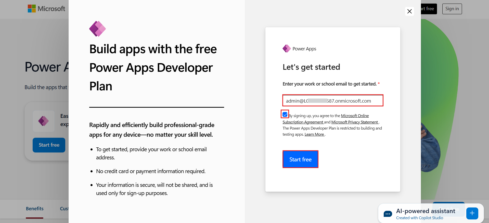
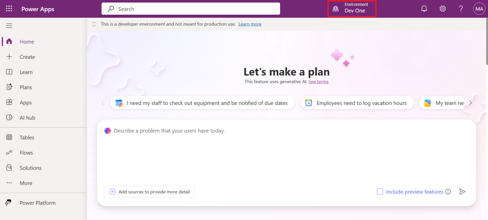
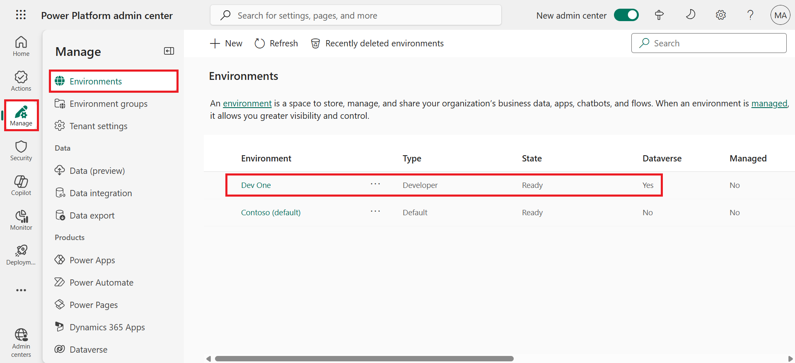
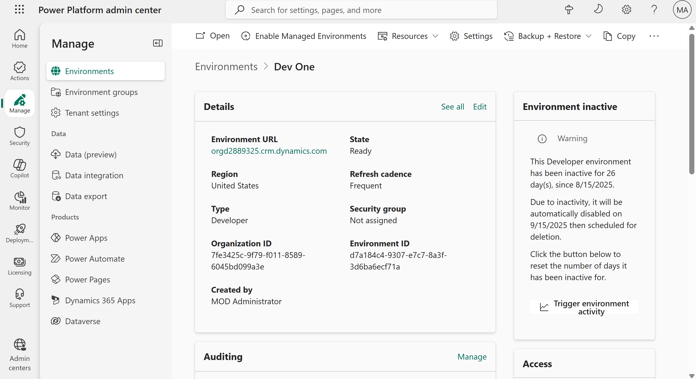

**Lab 0: Set up lab environment**

**Estimated Duration:** 10 min

**Objective:** In this lab, you will acquire Power Apps trial license.
You will also add users and assign licenses to them at the same time.

### **Task 1: Assign** **Power Apps trial license** 

1.  Open a web browser on your VM and go to
    +++<https://powerapps.microsoft.com/en-us/free/>+++.

> 

2.  Select **Start free**.

> 

3.  Enter your **Office 365 admin credential**, check the checkbox to
    **accept the agreement** and click on **Start free**.

> 

4.  Enter **password of your Office 365 tenant id** and then select
    **Sign in**.

> 

5.  Select **Yes** on **Stay signed in?** pop-up window.

> 

6.  You can now see **Home page of Power Apps.** From the environment
    selector, select the developer environment – **Dev One** which is
    created for you.

> 

7.  Open the new tab and go to Power Platform admin center by navigating
    to +++<https://admin.powerplatform.microsoft.com>+++ and if
    required, sign in using your given Office 365 admin tenant
    credentials.

> 

8.  From the left navigation pane, select **Manage** \> **Environments**
    and then you can see, **Dev One** is your Dataverse environment.

> 

9.  Review that the Dataverse environment has been changed to **Dev One
    Environment**.

**Summary**: In this lab, you acquired Power Apps trial license.
