# **Lab 1: Build a canvas app for a real estate solution with Copilot in Power Apps** #

**Estimated duration**: 15 min

## **Objective**: 
In this lab, you will learn to create a custom canvas app
in Power Apps through conversation with Copilot. You will learn how
Copilot generates tables, how to customize tables with the help of
Copilot and how to share an app with the user. ## 

**Note:** Copilot in Power Apps can generate different app layouts,
forms, and data connections apps.

## **Exercise 1: Build a canvas app and share with the user**

**Task 1: Create an app with Copilot**

**Note:** In this lab, your results for data might vary from those shown
in the screenshots and images. The reason is because Power Apps uses AI
to generate data for the lab and the data changes daily.

1.  Sign into the Power
    Apps +++[*https://make.powerapps.com/+++ using*](https://make.powerapps.com/+++%C2%A0using) your
    Office 365 tenant credentials.

2.  Select **Environment** **selector** to change it to developer
    environment – Dev One.

> 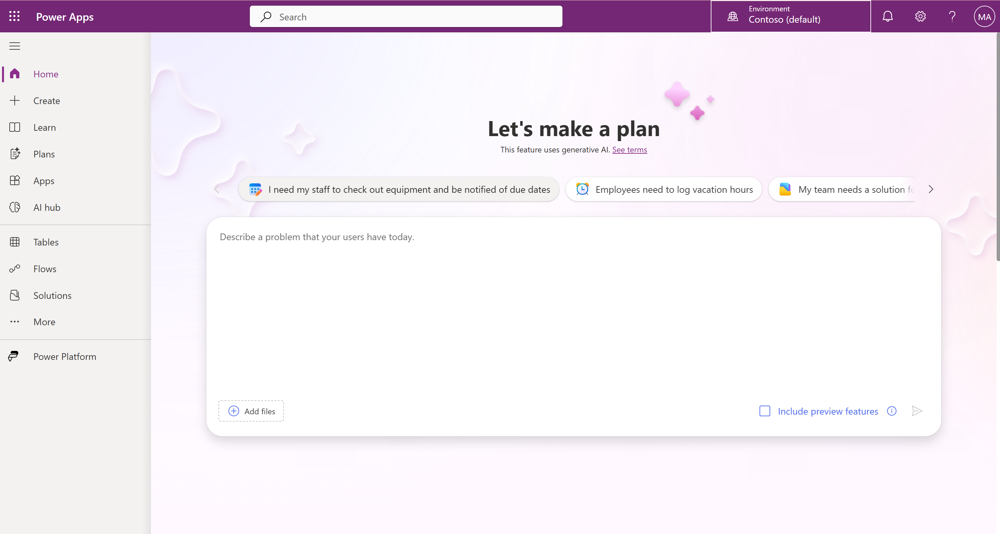

3.  Select **Dev One** environment.

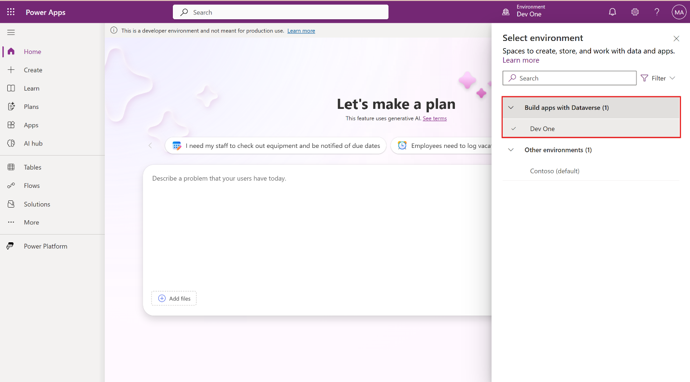

4.  

> 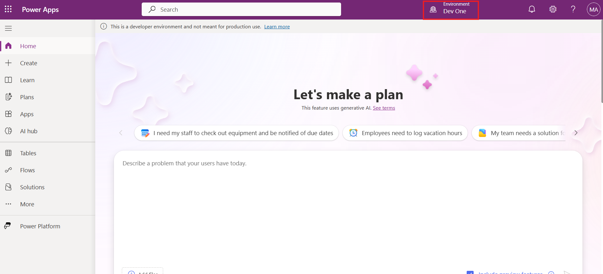

5.  From the left navigation pane, select **Apps** and then
    select **Start with Copilot**.

> 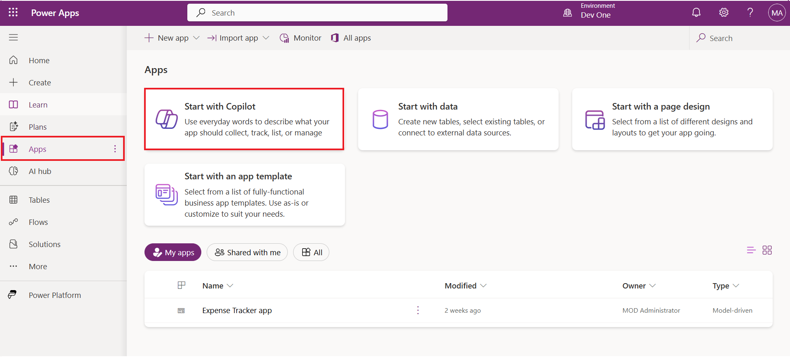

6.  Enter the following prompt to search for an AI-generated table:

> +++**Build an app to manage real estate showings**+++
>
> Select the **Generate** button.
>
> 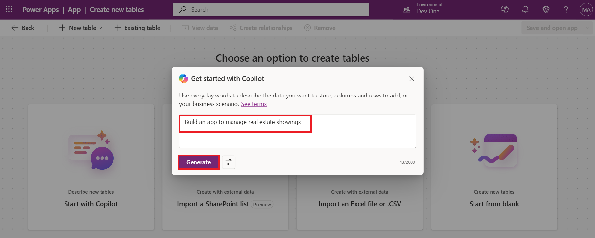

7.  If you come across any pop-up, close it.

8.  Copilot creates one or more Dataverse tables with data that includes
    typical real estate tasks.

> 

9.  To see more information, click on three dots of
    the **Showing** table and select **View data**.

> 

10. You can now see the columns on the **Showing** table.

> 
>
> Your next steps are to modify and add to the already generated table.

11. Check if **Feedback** column is present in the **Showing** table. If
    yes then go to the next step, if no then select
    the **Showing** table, enter the below prompt in the copilot pane
    and click on the **Send** button.

> +++**Add the Feedback column**+++
>
> 

12. Now click on the **Showing table** and then in the text box, in the
    lower part of the Copilot pane to the right of the screen, enter the
    following text and select the **Send** button.

> +++**Rename Feedback column as Details** **in Showing Table**+++
>
> This will rename Feedback column as Details in the showings table.
>
> 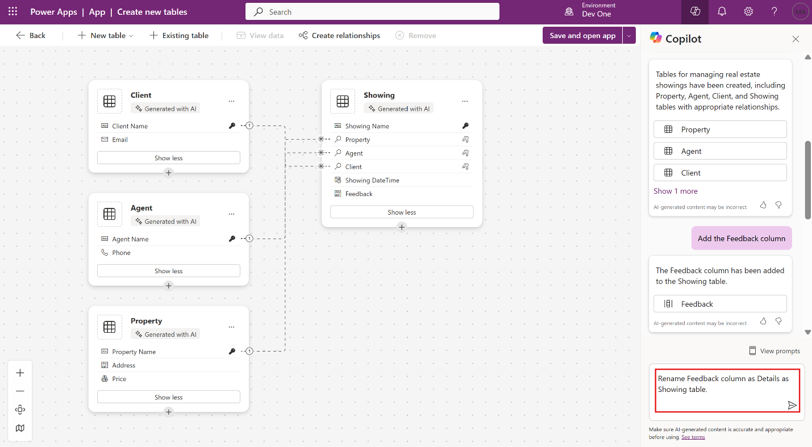

13. Now click on the **Showing table** and then in the text box, in the
    lower part of the Copilot pane to the right of the screen, enter the
    following text:

> +++**In showing table add a new column as client full name**+++
>
> This will add a column in the showings table. Select
> the **Send** button.
>
> 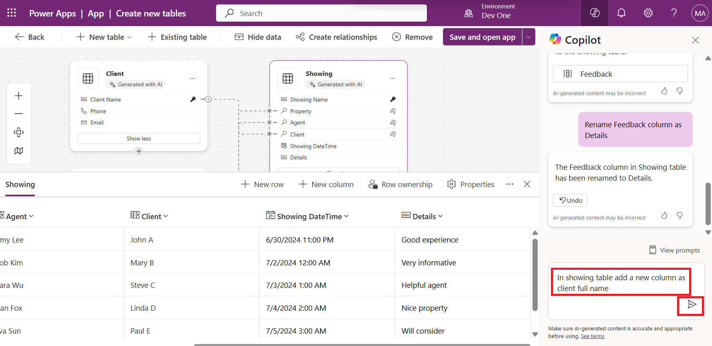

14. Select **Save and open app**.

> 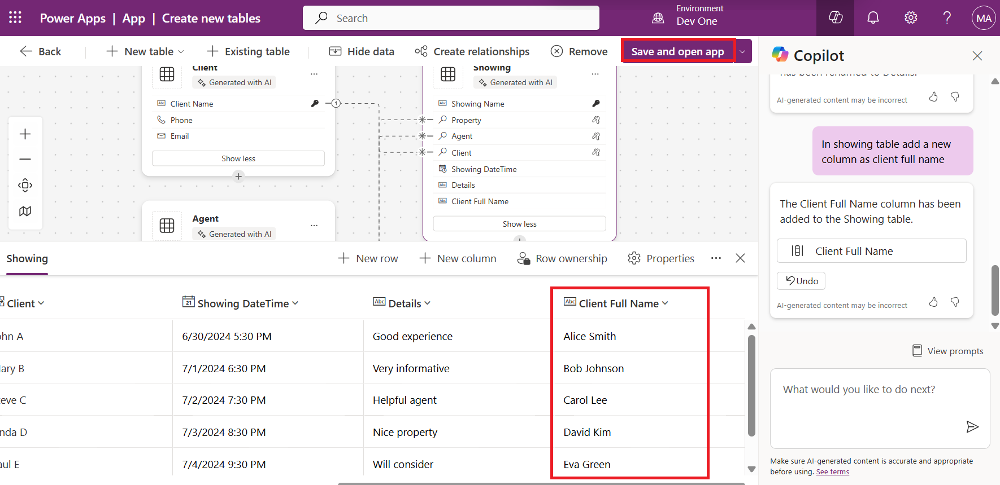

15. Again, select **Save and open app** on **Done working?** pane.

> 

16. When the app first loads, a dialog might appear stating “**Welcome
    to Power Apps Studio”**. If so, select the **Skip** button.

> 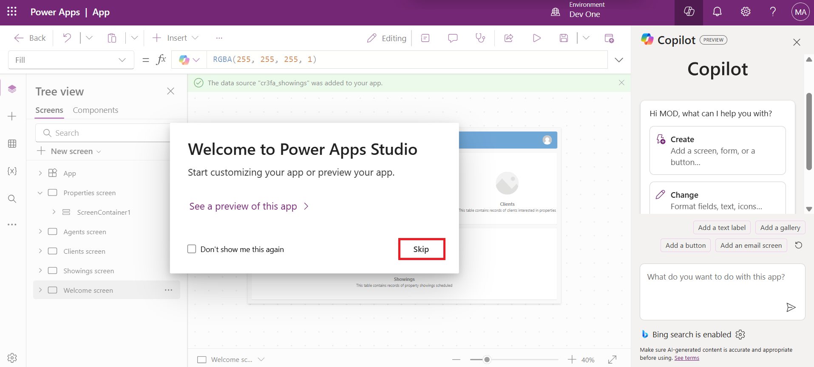

17. The app that has been built for you should show in **Edit** mode.

> 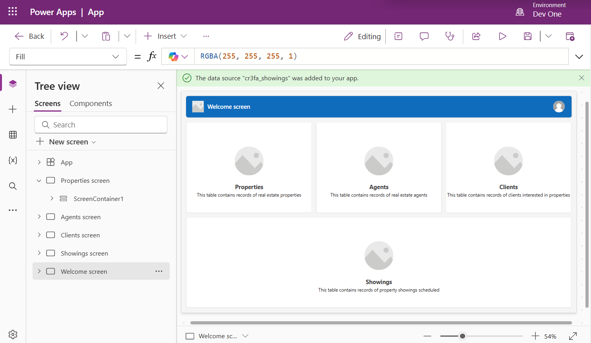

18. For a better view, close the Copliot pane.

> 

19. Select the **Data** icon from the left navigation bar. Copilot has
    created a **Dataverse** table that's now displaying in
    the **Environments** section.

> 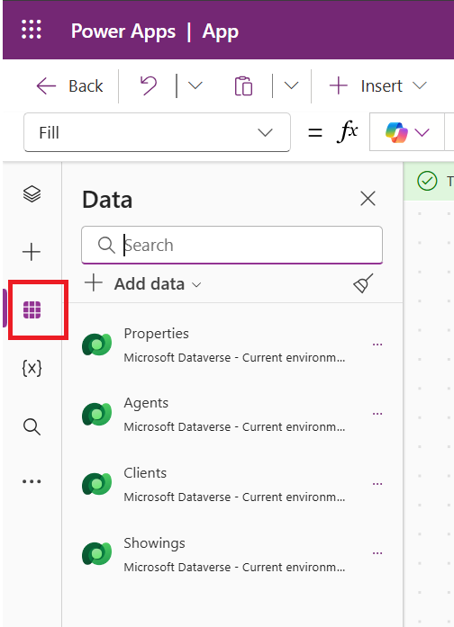
>
> **Note**: Currently, Copilot is only supported for Dataverse. You
> can't use any other data access point at this time.

20. Select the **Tree view** from the left navigation bar. You can see
    the **Welcome screen** is opened in the canvas and other remaining
    screens are listed under the Tree view on left side.

> 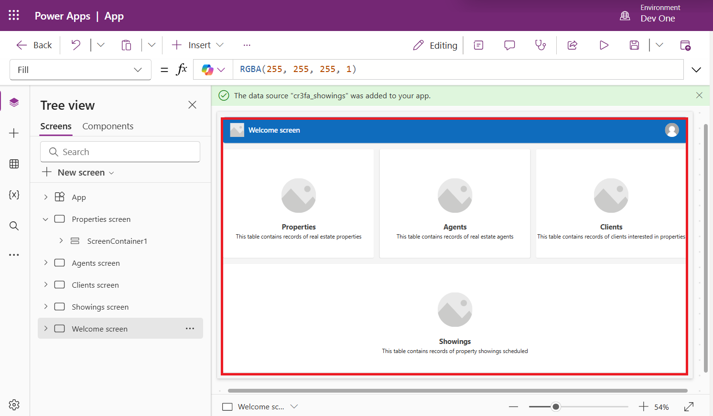

21. Click on **Showings screen** in the **Tree view** and you can see
    the screen is now opened.

> 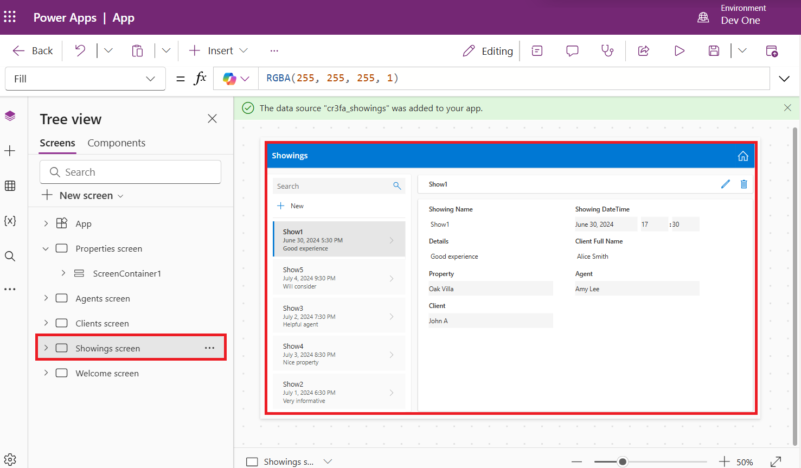

22. From the upper part of your screen, select the **Save** button to
    save the new app that you created.

> 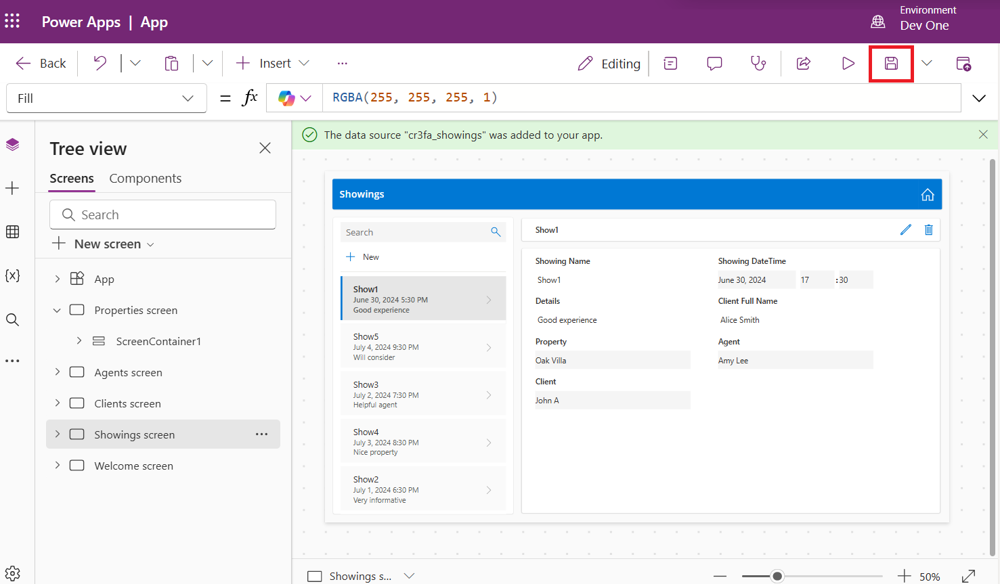

23. Give the app name as +++**Real Estate Showings**+++ and
    select **Save**.

> 

**Task 2: Test the app**

1.  Select the **Play** button from the upper part of the screen to test
    the app.

> 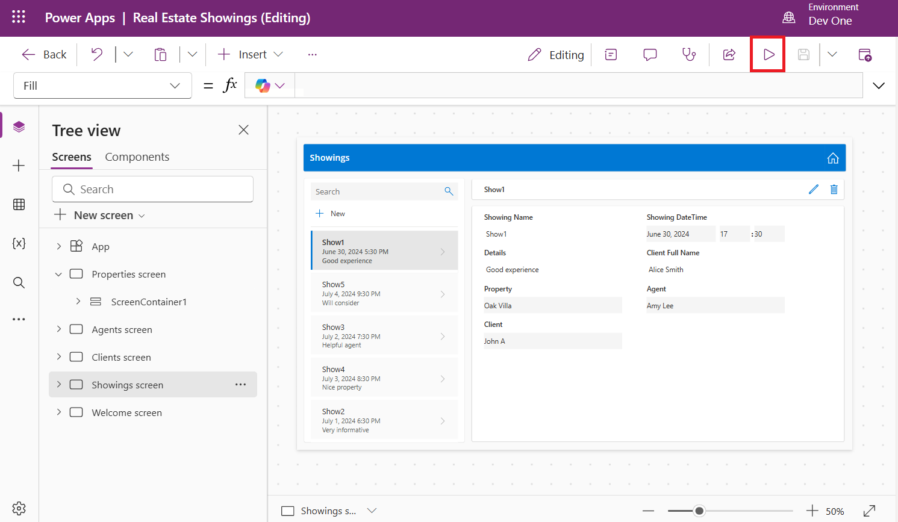

2.  In the left pane, select the **+New** button.

> 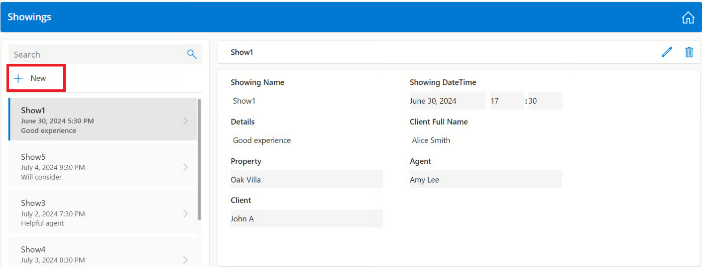

3.  Fill in the fields with the following information and then select
    the check mark in the upper-right corner of the screen.

> **Showing:** +++Showing 6+++
>
> **Showing Date:** Enter any future date
>
> **Time:** 09:00
>
> **Agent Name:** Select any from the suggestions.
>
> **Details:** +++Spacious+++
>
> **Property:** Select any from the suggestions. 

4.  To close the test window, select cross mark at the top right corner
    of the screen.

> 

5.  You will be navigated to the editing window. Select **Ok** on the
    ‘**Did you know**’ pop-up window.

> 

6.  To publish the app, select **Publish** button on from the top right
    of the screen.

> 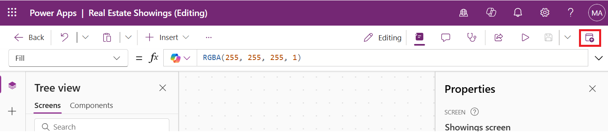

7.  Select **Publish this version**.

> 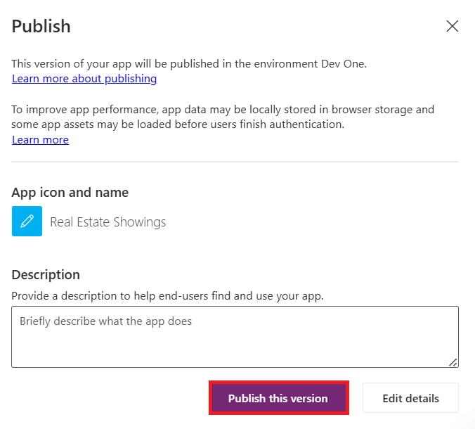

8.  Select **\<- Back** to go back on the home page.

> 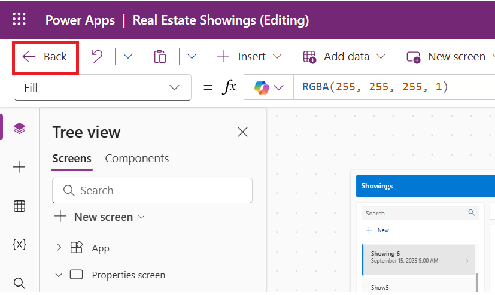

9.  Select **Leave**.

> 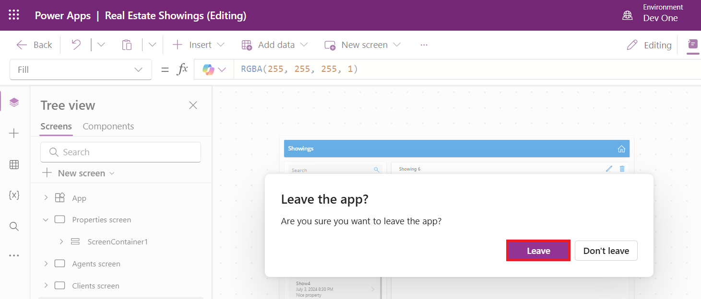

**Task 3: Share the app with user**

1.  Select **Apps** from left navigation pane, select **Real Estate
    Showings** app and then select **Share** from above horizontal
    palette.

> 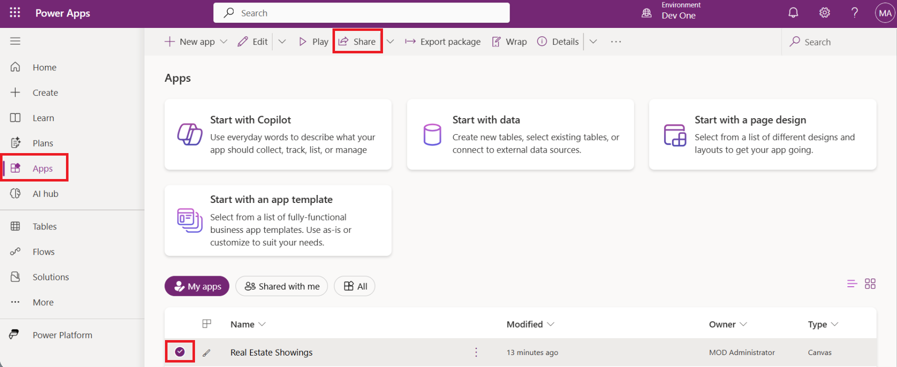

2.  Type +++Brooke+++ and then select **Brooke Gray** from the
    suggestions.

> 

3.  Select **Share**.

> 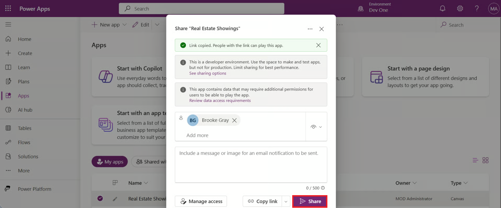

4.  Select **Copy link**.

> 

5.  Open the link in the new tab and sign in with Brooke Gray’s email
    ID. Open a new browser, paste the above link and sign in with
    Brooke's credentials and then you can see the app.

> **Note**: Open the Outlook account of the Brooke Gray with Login id
> - [*+++brookeg@LODSA7xxxxx.onmicrosoft.com*](mailto:+++brookeg@LODSA7xxxxx.onmicrosoft.com)+++
> (**change the domain name** in login id) and Password –
> +++Pa$$w0rd@124+++.
>
> 

6.  Select **Showings** screen.

> 

**Summary**: In this lab, you learnt how to create a custom canvas app
using copilot, how to customize and share the app with the user.

