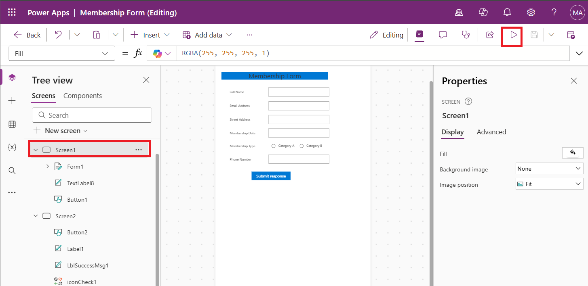

# **Lab 2: Create a canvas app from an image and add Copilot control (Preview)**

**Estimated duration**: 20 min

## **Objective**: ##
In this lab, you will learn how to create an app from a
visual design and connect it to data through a few simple, guided steps.
You will learn to customize the app and learn how to add a Copilot
control to a canvas app.    

**Note:** Copilot in Power Apps can generate different app layouts,
forms, and data connections apps.

## **Exercise 1: Create a canvas app from an image**

### **Task 1: Create an app**

1.  Sign in with your Office 365 tenant credentials to Power Apps using
    <https://make.powerapps.com/>.

2.  Ensure that you are in **Dev** **One** environment.

    

3.  Select **+ Create** from the left-pane and then select **Start with
    a page design**.

    

4.  Select **Image** **or Figma file**.

    

5.  Ensure that **Start from an image** is selected. Review the examples
    of recommended images and tips. Once you’re done, select
    the **Next** button.

    

6.  Enter a name for the app – **Membership Form**. Select **Start with
    sample image**. Select **Membership form image**. Select **Phone**
    format and then select **Next**.

    

    **Note:** If you're using your own image, the image file extension
    must be .jpg or .png, and the file size must be less than 4MB. Also,
    the image must contain a clearly legible one-page form with a light
    background color. For the best results, edit your image so that it has
    a white background and high contrast.

7.  Your image will be automatically tagged based on the components that
    were identified. For example, in the following sample image, the box
    that says “Enter your first name” was identified as a **Text
    input** control. After you've reviewed the tags and ensured that
    each component is correctly tagged, select **Next**.

    **Note:** You can draw a new tag by selecting and dragging to select
    the region that encompasses the component. Then, choose the type of
    component that you want to associate the new tag with.

    To make edits to an existing tag or to delete it, select the tag. You
    can then assign a different component for that tag, or adjust the
    dimensions of the tag by dragging the corners to change the size. If
    you'd like to remove the tag, select **Delete tag**.

    

    **Tip:** Select the **Guidance** tab on the right-side of the screen
    to learn more about the different types of components and how to
    accurately tag each one.

8.  The next step is to set up data. For the best experience,
    select ***Connect to a Dataverse table*** and select **Next**.
    You'll be guided in the next stage to either select an existing
    Dataverse table you have and map the fields in the image to the
    columns in that table or create a new table in Dataverse and add
    columns based on the form fields in your image, and your app will
    contain a form component that is connected to your Dataverse table.

    **Note:** The option to Connect to a Dataverse table will be disabled
    if you don't have Dataverse in your environment. If you don't want to
    connect to Dataverse, select **Skip this for now**. If you choose this
    option and select **Create**, your app will be created as-is, which
    means that the components you tagged in the previous step will be
    generated directly. They won't be placed into a form component, and
    your app won't be connected to data.
    
    

9.  From the drop-down menu of the **Table name** field, choose **Create
    new table** and then select **Next**.

    
    
    **Note:** Each tag corresponds to a data column based on the form
    fields that were identified in your image. You can edit the table and
    column details. Select a tag to modify the column properties, such
    as **Display Name**, **Name**, and **Data type**. To remove an
    existing column, select the tag and then select **Delete column**.

10. Select **Next**, you'll be able to review the table and column
    structure.

    **Note:** Select **Table properties** on the right-side of the screen
    to view and edit the properties for your new table.

    

11. Once you've completed the review, select **Create app** to create
    the app.

    
    
    **Note:** The app creation might take few minutes.

12. Once the app is created, your new app will open in Power Apps Studio
    so you can continue building and customizing your app.

13. As you have chosen to create a new table in Dataverse, your form
    will be automatically connected to your new table. To check that,
    click on the **Form1** under the **Tree view** and observe that
    under the **Properties** pane, **Membership Form** is selected as a
    **Data source**.

    

14. Select **Save** icon to save the app.

    

### **Task 2: Customize the app**

1.  Select **App** from the **Tree view**.

2.  Select **Formulas** from the property selector.

3.  Write the given formulas to store background color of text label and
    the button color into the variables.

    *BGColor = RGBA(0, 120, 212, 1);*

    *ButtonColor = RGBA(0, 120, 212, 1);*

    

4.  From the **Tree view**, select **Textlabel8** under the **Screen1**.

    

5.  In the Property selector, select the **Fill** property of Text
    label, delete the existing color value and enter the value –
    **BGColor**. Note that, BGColor contains the color value.

    

6.  Adjust the width of Membership Form **Text label** as shown in the
    image.

    

7.  Select the **Text label** and change the alignment to center. If
    **Align** option is not visible, click the ellipsis (…) icon next to
    the font type selector.

    

8.  Select the **Button1 (Select response)** on the canvas and move it
    to the center of the form.

    

9.  To add new screen to the app, select **+New screen** from the Tree
    view. Select **Success** screen.

    

10. Double click on the **Success message** and change it to “**Your
    response submitted successfully**”.

    

11. To add Text label, select **+Insert \> Text label**.

    

12. Move the **Text label** below the success message and change the
    **Text** property of the label to "**If you need more information,
    kindly click on below Copilot button**".

    

13. Change the **Font** of the label to **Segoe UI**, **Font size –
    21**, **center alignment** and resize the label as shown in the
    image below.

    

14. Select **+Insert \> Button**.

    

15. Move the button below the text label. Double click on the button and
    change the **Text property** of it to “**Copilot**”.

    

16. To add one more screen to the app, select **+New screen \> Blank**.

    

17. To add navigation path to each screen, select **Screen1** from the
    Tree view.

    

18. Select **Submit response button** on Screen1. Add following formula
    to the existing formula of OnSelect property of the button.

    **Note**: Ensure that, the existing formula is ended with semicolon
    (;).
    
    *Navigate(Screen2);*
    
    

19. Now, select **Screen2**.

    

20. Select **Copilot button** and change its **OnSelect** property to
    the given formula.

    *Navigate(Screen3);*
    
    

21. Select the **Fill** property of the button and replace it with the
    **ButtonColor**.

    **Note:** ButtonColor is the Named variable which contains color
    value.
    
    

22. Save the app.

    

## **Exercise 2: Add Copilot control to a canvas app (preview)**

### **Task 1: Add the Copilot control to your canvas app**

1.  Select **App** from the **Tree view**.

    

2.  On the command bar, select **Settings**. If the Settings is not
    visible, select **ellipsis** (…)

    

3.  Select **Updates**. Select he **Preview** tab, set the toggle
    for **Copilot component** to **On**.

    

4.  Now select **Screen3** in the Tree view. On the app authoring menu,
    select **Insert**. Select **Copilot (preview)** to add this control.

    

5.  When the Copilot control is added, from the
    control **Properties** tab, select **Data source (Items)** and
    choose a Dataverse table – **Membership Forms** for your data
    source. Currently, the Copilot control can only answer questions for
    smaller datasets.

    
    
    

6.  Click on **Views** drop down and select **Active Membership Forms**.

    

7.  Select **Edit** in front of the Fields control from the
    **Properties** pane.

    

8.  To remove **Created On** column, select (…) next to **Created On**
    and then select **Remove**.

    

9.  Add all the fields present in the app. Select **Add fields**, select
    **Email Address**, **Membership Date**, **Membership Type**,
    **Street Address** and **Phone Number** and then select **Add**.

    

10. Move the Copilot control to the center of the screen.

    

11. Select **+Insert \> Button**.

    

12. Move the button as shown in the belove image.

    

13. Doble click on the Button control and change its **Text** property
    to **Done**. Move the Button below the Copilot control.

    

14. Now select the **OnSelect** property of the Button from property
    selector and change it to the given formula.

    Navigate(Screen1);
    
    

15. Save the app.

    

16. Select **Test** icon to test the app.

    

17. Fill up the Membership form and select Submit response. You will be
    navigated to **Success** screen.

    

18. Select **Copilot** button.

    

19. Ask more questions. For example – What is the Membership type of
    Sara?

    **Note:** To have better experience, add more responses to the data.
    
    

20. Select **Done**.

    

**Summary**: In this lab, you learnt how to create a canvas app from an
image, how it gets connected to your data stored in the Dataverse and
how to customize the app. You also learnt how to add Copilot control to
a canvas app which lets app users get insights about the data in your
app through natural language conversations with an AI-powered copilot.

