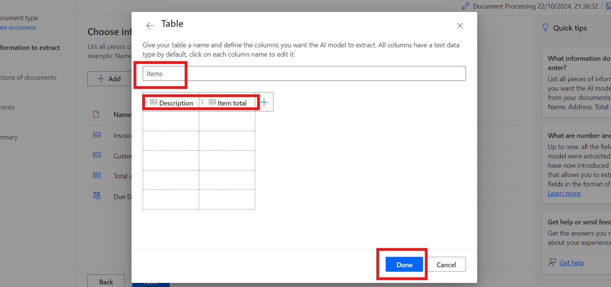

# **Lab 6 - Use invoice processing in Power Apps** #

**Estimated Duration:** 45 min

## **Objective:** 
In this lab, you will learn how to create AI model using
AI Builder in Power Automate. The model will be trained to extract
custom information, such as invoice numbers, customer IDs, total
amounts, and due dates, from documents like invoices. You will learn how
to sign into AI Builder, choose document types, define fields to
extract, upload documents for training, and finally, integrate the
trained model with Power Automate and Power Apps.

**Exercise 1: Create your first model**

**Task 1: Sign in to AI Builder**

1.  Navigate to power automate with the help of
    +++\*\*[*https://make.powerautomate.com/\*\*+++*](https://make.powerautomate.com/**+++) and
    if asked, sign in using office 365 admin tenant account.

2.  Select the environment **Dev one** from the top bar.

> 

3.  Navigate to the left pane and select **AI Hub**, then click on **AI
    Models.** If you don't see AI Hub, click on **More** to locate it.

> 

4.  Choose the **Extract custom information from documents** option.

> 

5.  Scroll Down and click on **Create custom model** to proceed.

> 

**Task 2: Choose document type**

1.  When choosing the document type, you have three options:

    - **Fixed template documents:** This option is ideal when, for a
      given layout, the fields, tables, checkboxes, and other items can
      be found in similar places. You can teach this model to extract
      data from structured documents that have different layouts. This
      model has a quick training time.

    - **General documents:** This option is ideal for any kind of
      documents, especially when there is no set structure or when the
      format is complex. You can teach this model to extract data from
      structured or unstructured documents that have different layouts.
      This model is powerful but had long training time.

    - **Invoices:** Invoice documents are standard account payable
      forms. This model type comes with standards fields, and you can
      teach this model to extract additional custom data or update the
      standard data.

2.  Select **Fixed template documents** and click **Next**.

> 

**Task 3: Choose information to extract**

Define the fields and tables you want your model to extract. We'll
extract the following fields:

- Invoice number

- Customer ID

- Total amount

- Due date

1.  Click **+** **Add** and select Text field, then click **Next**.

> 
>
> 

2.  Enter the text field name as +++**Invoice Number**+++ and
    select **Done**. Repeat this step for +++Customer ID+++.

> 

3.  Click **+ Add** and select **Number field**, then click Next.

> 
>
> 

4.  Enter the number field name as +++**Total amount**+++ and
    select **Done**.

> 

5.  Click **+ Add** and select **Date** field.

> 
>
> 

6.  Enter the date field name as +++**Due Date**+++ and select **Done**.

> 

7.  To extract table details from the invoice, we will create a table
    named Items with columns Description and Item total. To do so,
    click **+ Add** and select **Table**.

> 

8.  Select **Table** and click **Next**.

> 

9.  Define the table name as +++**Items**+++.

10. Select Column1, Click on **Edit column** and rename it to
    +++Description+++, then click **Confirm**.

> 
>
> 

11. Click **+ New column**, enter the column name as +++Item total+++,
    then select Add. Finally, click **Done**.

> 

12. Click **Next** to proceed to the next step in your model.

> 

**Task 4: Define collections and upload documents**

Define collections and upload documents. A collection groups documents
with the same layout. Create a collection for each unique layout your
model needs to process. Since there are two invoice providers using
different templates, we'll create two collections.

1.  Click **New collection** name and rename the first collection as
    +++Adatum+++.

2.  Add another **New collection** and name it +++Contoso+++.

> 

3.  Click on the Adatum and then click on the **Add document**. Then
    select My device, For **Adatum**, upload the five documents which is
    available in **C:\Lab Files\Adatum\Train** folder.

> 
>
> 

4.  Click on the **Upload 5 document** and then click on **Done**.

> 
>
> 

5.  Click on the Contoso and then click on the **Add document**. Then
    select My device, For **Contoso**, upload the five documents from
    the **C:\Lab Files\Contoso \Train** folder.

> 
>
> 

6.  Click on the **Upload 5 document** and then click on **Done**.

> 
>
> 

7.  After uploading the sample documents to each collection,
    select **Next** to continue.

> 

**Task 5: Tag documents**

Start teaching your AI model how to extract the fields and tables by
tagging the sample documents you've uploaded. As you tag the expected
fields in each document, a check will appear over that document, and the
red dot at the top corner will disappear.

1.  Select the **Contoso** collection from the right panel to begin
    tagging.

> 

2.  **Tag Fields:**

    - Start by tagging fields like **Invoice Number,** **Due date, and
      Total amount.**

    - Draw a rectangle around each field in the document, then select
      the corresponding field name.

    - Resize your selection if needed. Hovering over words will show
      light blue boxes, indicating where you can draw rectangles.

> 
>
> 
>
> 

3.  Go to Customer ID in the Contoso collection, select the
    ellipsis **(…)** next to the field on the right panel and
    choose **Not available in the document**.

> 

4.  **Tag Tables:**

    - Draw a rectangle around the table you want to tag and select the
      table name.

    - Draw rows by left-clicking between row separators.

    - Draw columns by pressing Ctrl + left-click (or ⌘ left-click on
      macOS).

    - Assign the headers by selecting the header column and mapping it
      to the desired one.

    - If you've tagged the table's header, select Ignore first row to
      prevent it from being extracted as content.

> 
>
> 
>
> 

5.  Once you've tagged a document, move to the next one by selecting the
    next document from the list.

> 

6.  While tagging the table, you can see that columns are already
    tagged. Select the rows and ensure that, on the Items pane which is
    opened on the right side of the screen, if you've tagged the table's
    header, select Ignore first row to prevent it from being extracted
    as content. Select **Done** from the Items pane.

7.  Once you've tagged all the documents, move to the next one by
    selecting the navigation arrows at the top right of the document
    preview.

> 

8.  Now select the **Adatum** Collection.

> 

9.  **Tag Fields:**

    - Start by tagging fields like **Invoice Number, Customer ID and
      Total amount.**

    - Draw a rectangle around each field in the document, then select
      the corresponding field name.

    - Resize your selection if needed. Hovering over words will show
      light blue boxes, indicating where you can draw rectangles.

> 
>
> 
>
> 

10. Go to **Due Date** option and select **Not available in
    collection.**

> 

11. **Tag Tables:**

    - Draw a rectangle around the table you want to tag and select the
      table name.

    - Draw rows by left-clicking between row separators.

    - Draw columns by pressing Ctrl + left-click (or ⌘ left-click on
      macOS).

    - Assign the headers by selecting the header column and mapping it
      to the desired one.

    - If you've tagged the table's header, select Ignore first row to
      prevent it from being extracted as content.

> 
>
> 
>
> 
>
> 

12. Tag all five documents with same process. Once you've tagged a
    document, move to the next one using the navigation arrows at the
    top right of the document preview.

**Task 6: Model summary and train**

1.  Select the **Next** button at the bottom of the screen.

> 

2.  Review the **Model summary**. Under Information to extract you'll
    see that Customer ID and Due Date only appeared in five examples out
    of **10**, whereas everything else appeared in all 10 examples.

3.  If everything looks acceptable, select **Train**.

> 

4.  Click on the **Go to model** button while training.

> 

**Exercise 2: Use your model**

**Task 1: Quick test**

1.  After your model completes training, Click on the model name to view
    important details about your newly trained model on a details page.

> 
>
> 

2.  To see your model in action, select **Quick test**.

> 

3.  Drag and drop or upload an image from your device to test. From the
    previous sample data, use the files from the Test folders that we
    didn’t use for training (either from C:\Labfiles\Adatum\Test or
    C:\Labfiles\Contoso\Test).

4.  You can now view the detected fields that you chose and the
    associated confidence scores for retrieving the individual fields
    compared to the trained model. Click on the **Close** button.

> 

**Task 2: Publish your model**

1.  Your model can't be used until you publish it. If you're satisfied
    with your model, select **Publish** to make it available for use.

> 

**Task 3: Use your model in Power Apps**

Now that your model is published, you can use your Document processing
model in a canvas app. A special component is available for you to add
that analyzes any image and extracts the text based on your trained
Document processing mode.

1.  From the 
    +++[*https://make.powerautomate.com/+++*](https://make.powerautomate.com/+++),
    select **AI Hub**, and select your model under Recently Created.

> 

2.  Select **Use model**.

> 

3.  Select **Build intelligent apps** to begin the canvas app creation
    experience.

> 

4.  Within your canvas app, a **Form processor component** is
    automatically added and linked to your published Document processing
    model.

> 
>
> 
>
> **Note:** If you want to add additional AI models to the app, select
> Insert and then select Form processor to add a Form processor
> component. Next, select the AI model property from the right-hand
> properties panel. A list of AI models appears to select. Only
> published models appear in the drop-down list.
>
> 

5.  Next, we select which field from the invoice to display.
    Select **Insert** and then add a **Text** **Label** component.

6.  With the label selected, make sure that **Text** property is
    selected in the top left-hand corner. In the formula bar,
    write +++FormProcessor1.Fields+++. This code gives you access to the
    other properties from the model as well. For this exercise, we
    choose **Invoice Number**. The result looks similar to this image.

> 
>
> **Note:** Notice how 'Invoice Number' is in single quotes in the
> previous image. This is because when the Invoice Number column was
> created, the column name was created with a space in between the
> words. If your columns weren't created with spaces, you don't need the
> single quotes and your code may look like this image instead.
>
> 

7.  Next, we add a gallery so we can see the data from the items of the
    invoice. Select **Insert** and then **Vertical Gallery**.

8.  In the Items property of the gallery,
    write: +++FormProcessor1.Tables.Items+++

> 

9.  Select **Play** on the upper right of the Power Apps studio to
    preview the app.

10. Select **Analyze** and then select the image that you used to quick
    test previously.

> 

11. A preview of your document shows the **Invoice Number** and the
    items from the invoice.

> 

**Summary:** In this lab, you learn how to build and train a custom AI
model capable of extracting specific data fields from documents. You
learnt how to test the model with real-world data, integrate it into
automated workflows within Power Automate, and use it within a canvas
app in Power Apps. In this lab You learnt how AI models can be used to
automate document processing and streamline business tasks, providing
practical experience in leveraging AI Builder for intelligent
automation.

