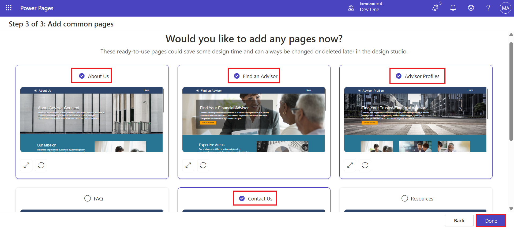
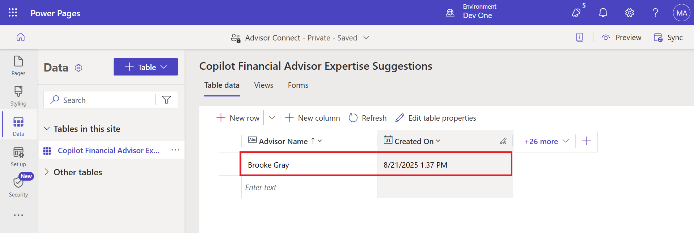

# **Lab 7: Create an AI-generated site using Copilot** #

**Estimated Duration:** 15 min

## **Objective:** 
In this lab, you will learn how to create a site with the
help of Copilot. You will also learn how to generate a webpage, create a
form, and add AI generated text to the page.

**Note:** Copilot in Power Apps can generate different app layouts,
forms, and data connections apps.

### **Task 1: Create a site with the help of AI**

1.  Go to Power Pages using
    +++<https://make.powerpages.microsoft.com/>+++. Select Get started
    and ensure that you are in **Dev One** environment.

> 

2.  Select **Skip** on **Tell us about yourself** page.

> 

3.  Enter the given description to create a site and then click on the
    **generate** icon.

> +++**Create a site for customers to find financial advisors at a bank
> based on their qualifications, and areas of expertise**+++
>
> 

4.  Copilot generates a site name and a web address based on your
    description. In this case, the site name is ‘**Advisor Connect’**.
    Keep the generated site name and address and then select **Next**.

> 

5.  Copilot generates a home page layout, which you can scroll through
    and browse the page generated. Select **Next** to accept the
    suggested layout.

> **Note:** You can select **Try again** to generate a new layout.
>
> 

6.  Copilot generates more pages that could be used in the site based on
    the description. In this example, Contact us, Find an Advisor,
    Advisor Profiles and Contact Uspages are selected and then
    select **Done** to complete the site creation.

> **Note:** If you copilot generates different pages for your site than
> the above-mentioned pages, then you can select some of them.
>
> 

7.  Site creation can take a few minutes. When finished, you're
    redirected to the site opened in the design studio that you can
    customize further.

> 

### **Task 2: Generate a webpage**

To use Copilot to generate a webpage:

1.  Initially you will be on the **Pages** workspace.

> 

2.  Select the Copilot button in the command bar, if the Copilot panel
    is not open already.

> • Type a description of your webpage in the Choose a starter prompt,
> request an action, or ask a question text field.
>
> Sample descriptions:
>
> - [**Create a Thank you for visiting our site
> webpage**](urn:gd:lg:a:send-vm-keys)
>
> 
>
> To complete page review, select **Keep it**.
>
> 
>
> After the page is generated, it's added to the main navigation, and
> you can review the page and the content. Sections, text, and images in
> the page are low-code editable using the WYSIWYG editor.
>
> 

### **Task 3: Create a form with Copilot**

1.  Ensure you are on the **Pages** workspace and select an **Advisor
    Profiles** page for your form.

> 

2.  Hover the mouse over first section of the Routes webpage and then
    click on **+ Add a section** \> **1Column**.

> 

3.  Select **More** and then select **Form** component.

> 

4.  In the text box under Describe a form to create it, describe your
    form. You can use up to 250 characters in your description. To send
    your description to Copilot, press the Enter key or select the paper
    airplane icon in the lower-right corner of the text box.

> **Example**: Create a form for collecting suggestions and
> addition/deletion of areas of expertise of the financial advisor
>
> 

5.  To add the form to the page, select **OK**.

> 

6.  You can see the form section on the Advisor Profiles page.

> 

### **Task 4: Generate text with Copilot**

1.  On the **Pages workspace** and select **About Us** page for your
    form.

> 

2.  Hover the mouse over the page and select **+Add a
    section** \> **1Column** under Our Services section.

> 

3.  Select the **Text** component.

> 

4.  In the text component toolbar, select the **Copilot** icon.

> 

5.  Describe the text that you want to Copilot to generate; for example,
    " [**I want to describe the importance of
    a**](urn:gd:lg:a:send-vm-keys) **financial advisor**". You can use
    up to 1,500 characters in your description. To send your description
    to Copilot, press the Enter key or select the paper airplane icon in
    the lower-right corner of the text box.

> 

6.  Check the **preview** below your description and refine the text as
    needed.

    - To refine your description and generate new text,
      select **Rewrite**.

    - To keep the generated text but make it sound more friendly,
      casual, educational, professional, or excited, select **Change the
      tone**.

    - To keep the generated text but make it more concise or expand on
      it, select **Adjust the length**.

    - To give Copilot more information, select **Add more details for
      Copilot to work with**.

    - To give Microsoft feedback on how well Copilot interpreted your
      description or refinement, select the thumbs-up or thumbs-down
      icon.

7.  To add the text to the page, select **Add to page**.

> 

8.  You can see that Copilot has added text to the page.

> 

### **Task 5: Testing your site**

1.  Select **Preview**, followed by **Desktop**. If asked sign in with
    admin credentials and check the **checkbox of the consent** and
    select **Accept**.

> 
>
> 

2.  You can see the home page and the list of other webpages.

> 

3.  Select the **Advisor Profiles** page. You can observe the
    AI-generated form.

> 

4.  Fill up the few fields of the form and then select **Submit** button
    at the end of the form.

> 
>
> 

5.  Once you've successfully submitted the form, return to the design
    studio.

> **Note**: Try one more time if you don't get message of successful
> submission.

6.  Select **Data**, then select the **Copilot Suggestion Routes** table
    (table name can differ) and confirm that you can see that records
    were created using the multistep form process.

> 

**Summary:** In this lab, you learnt how to create a site with the help
of Copilot, how Copilot generates the HTML for the page with relevant
text copy and images from the description. create a form and add AI
generated text to the page. You also learnt how copilot generates text
and creates a form based on the given description.

