**Lab 8: Add advanced client-side functionality to your site**

**Task 1: Create site settings**

Before you can use the portals Web API, you have to enable the required
site settings with the Portal Management app. The site settings depend
on the table that you want to use when interacting with the Web API.

1.  Sign in to Power Pages
    +++\*\*<https://make.powerpages.microsoft.com/**+++>. If your site
    is already open, you can skip Steps 1 through 3.

2.  Select the target environment **Dev One** in the upper-right corner.

> 

3.  Under **Active sites** tab, you can see your site – **Finance
    Advisor Search**. Select **Edit**.

> 

4.  Expand the extension menu (ellipsis), and then select **Portal
    management** to open the Portal Management app.

> 

5.  On the left pane of the **Portal Management** app, select **Site
    Settings**.

6.  Select **New**.

7.  In the **Name** box, enter **Webapi/contact/enabled**.

8.  In the **Website** list, select your website record.

9.  In the **Value** box, enter **true**.

> 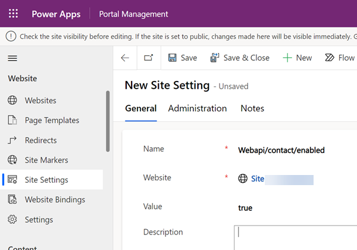

10. Select **Save & Close**.

11. Select **New**.

12. In the **Name** box, enter **Webapi/contact/fields**.

13. In the **Website** list, select your website record.

14. In the **Value** box, enter  
    **firstname,lastname,fullname,emailaddress1,telephone1**

> 

15. Select **Save & Close**.

16. Select **New**.

17. In the **Name** box, enter **Webapi/error/innererror**.

> 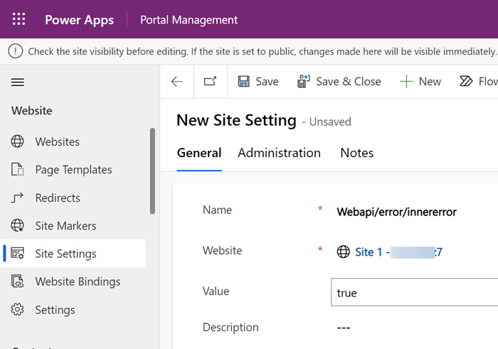

18. In the **Website** list, select your website record.

19. In the **Value** box, enter **true**.

20. Select **Save & Close**.

21. Verify the site settings for **Web API**.

**Task 2: Create a web role**

If you currently do not have a web role with permissions to the table
you are accessing through the Web API or require different context of
accessing the data, the following steps so you how to create a new web
role and assign table permissions.

1.  Start the [Portal
    Management app](https://learn.microsoft.com/en-us/power-pages/configure/portal-management-app).

2.  On the left pane, in the **Security** section, select **Web
    Roles** .

3.  Select **New**.

4.  In the **Name** box, enter **Web API User** (or any name that best
    reflects the role of the user accessing this functionality).

5.  In the **Website** list, select your website record.

> 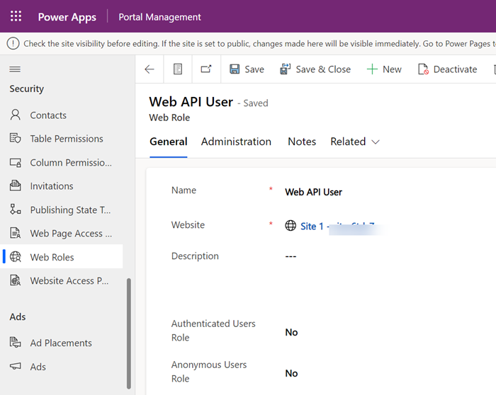

6.  Select **Save**.

**Task 3: Create table permissions**

1.  Go back to the **Power Pages design studio**.

2.  Select the **Security** workspace.

3.  Under the **Protect** section, select **Table permissions**.

4.  Select **New permission**.

5.  In the **Name** box, enter **Contact Table Permission**.

6.  In the **Table Name** list, select **Contact.**

7.  In the **Access Type** list, select **Global** **access**.

8.  Select **Read**, Update, **Create**, and **Delete** privileges.

9.  Select **+ Add roles** and select **Anonymousand Web API User**
    role..

10. Select **Save.**.

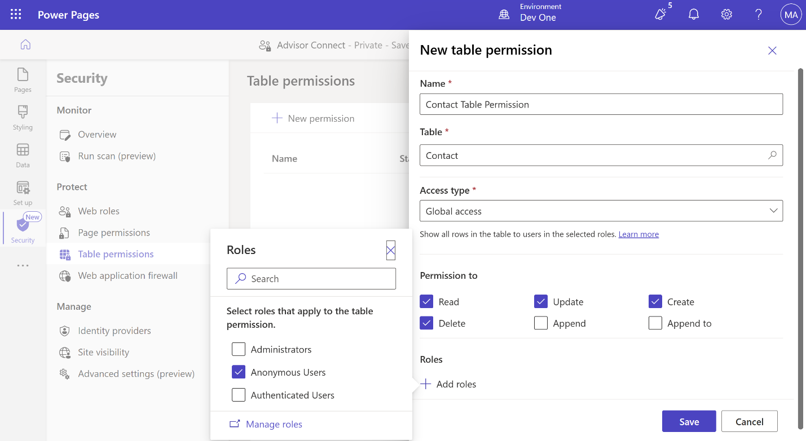

11. Select Save to confirm the permission settings.

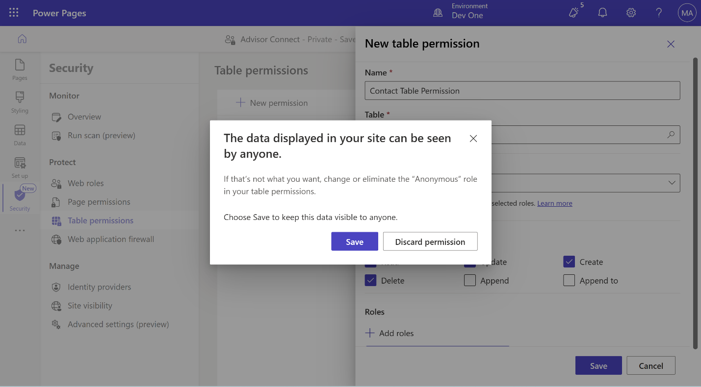

**Task 4: Add contacts to the web role**

1.  From the left navigation pane, select **More commands**.

2.  Select **Power Pages Management**.

3.  On the left pane, in the **Security** section, select **Contacts**.

4.  Select **+New**.

5.  Enter First Name - **Jessica**.

6.  Enter Last Name - **Liu**.

7.  Enter Email - [**jessica@example.com**](mailto:jessica@example.com).

8.  Select **Save & Close.**

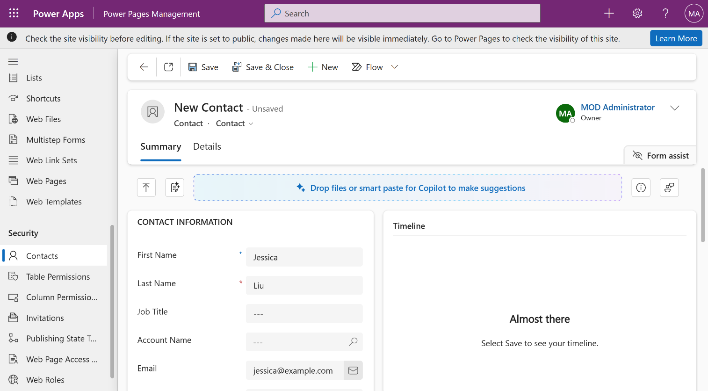

**Step 5: Create a webpage**

Now that you've enabled the Web API and configured user permissions,
create a webpage with sample code to view, edit, create, and delete
records.

1.  Go back to the **Power Pages Design Studio**.

2.  In the **Pages** workspace, select **+ Page**.

3.  On the **Describe a page to design it** window, select **Other ways
    to add a page** option.

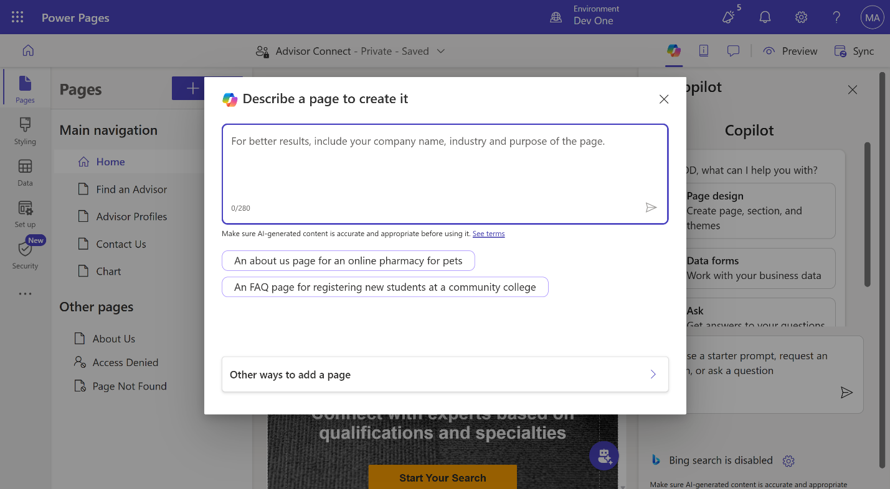

4.  In the **Name** box, enter **WebAPI** and select **Start from
    blank** layout.

5.  Select **Add**.

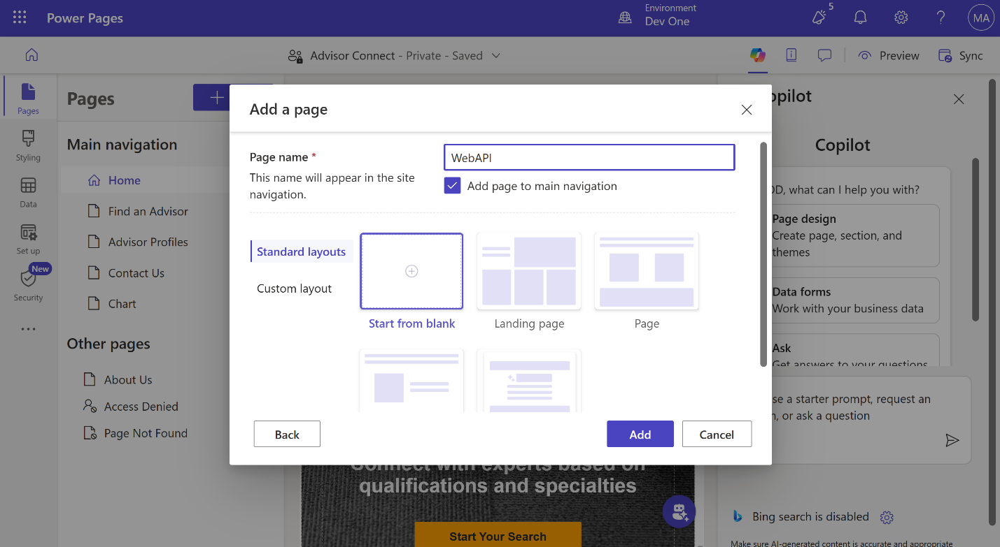

6.  Select the **Edit Code** option in the upper right hand corner.

7.  Select **Open Visual Studio Code**.

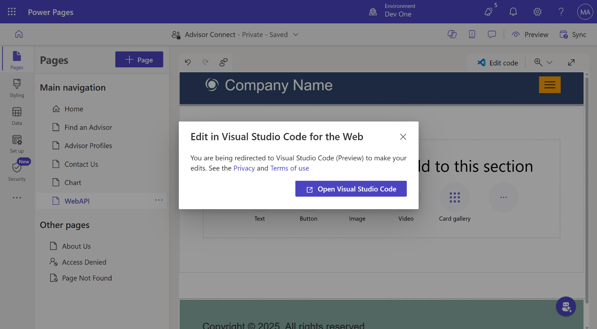

8.  Copy the following sample code snippet and paste it in between
    the \<div\>\</div\> tags of the page section.

> \<!-- Sample code for Web API demonstration --\>
>
> \<style\>
>
> \#processingMsg {
>
> width: 150px;
>
> text-align: center;
>
> padding: 6px 10px;
>
> z-index: 9999;
>
> top: 0;
>
> left: 40%;
>
> position: fixed;
>
> -webkit-border-radius: 0 0 2px 2px;
>
> border-radius: 0 0 2px 2px;
>
> -webkit-box-shadow: 0 2px 4px rgba(0, 0, 0, 0.2);
>
> box-shadow: 0 2px 4px rgba(0, 0, 0, 0.2);
>
> display: none;
>
> }
>
> table td\[data-attribute\] .glyphicon-pencil {
>
> margin-left: 5px;
>
> opacity: 0;
>
> }
>
> table td\[data-attribute\]:hover .glyphicon-pencil {
>
> opacity: 0.7;
>
> }
>
> \</style\>
>
> \<script\>
>
> $(function() {
>
> //Web API ajax wrapper
>
> (function(webapi, $) {
>
> function safeAjax(ajaxOptions) {
>
> var deferredAjax = $.Deferred();
>
> shell.getTokenDeferred().done(function(token) {
>
> // Add headers for ajax
>
> if (!ajaxOptions.headers) {
>
> $.extend(ajaxOptions, {
>
> headers: {
>
> "\_\_RequestVerificationToken": token
>
> }
>
> });
>
> } else {
>
> ajaxOptions.headers\["\_\_RequestVerificationToken"\] = token;
>
> }
>
> $.ajax(ajaxOptions)
>
> .done(function(data, textStatus, jqXHR) {
>
> validateLoginSession(data, textStatus, jqXHR, deferredAjax.resolve);
>
> }).fail(deferredAjax.reject); //ajax
>
> }).fail(function() {
>
> deferredAjax.rejectWith(this, arguments); // On token failure pass the
> token ajax and args
>
> });
>
> return deferredAjax.promise();
>
> }
>
> webapi.safeAjax = safeAjax;
>
> })(window.webapi = window.webapi || {}, jQuery)
>
> // Notification component
>
> var notificationMsg = (function() {
>
> var $processingMsgEl = $('#processingMsg'),
>
> \_msg = 'Processing...',
>
> \_stack = 0,
>
> \_endTimeout;
>
> return {
>
> show: function(msg) {
>
> $processingMsgEl.text(msg || \_msg);
>
> if (\_stack === 0) {
>
> clearTimeout(\_endTimeout);
>
> $processingMsgEl.show();
>
> }
>
> \_stack++;
>
> },
>
> hide: function() {
>
> \_stack--;
>
> if (\_stack \<= 0) {
>
> \_stack = 0;
>
> clearTimeout(\_endTimeout);
>
> \_endTimeout = setTimeout(function() {
>
> $processingMsgEl.hide();
>
> }, 500);
>
> }
>
> }
>
> }
>
> })();
>
> // Inline editable table component
>
> var webAPIExampleTable = (function() {
>
> var trTpl = '\<% \_.forEach(data, function(data){ %\>' +
>
> '\<tr data-id="\<%=data.id%\>" data-name="\<%=data.fullname%\>"\>' +
>
> '\<% \_.forEach(columns, function(col){ %\>' +
>
> '\<td data-attribute="\<%=col.name%\>" data-label="\<%=col.label%\>"
> data-value="\<%=data\[col.name\]%\>"\>' +
>
> '\<%-data\[col.name\]%\>\<i class="glyphicon
> glyphicon-pencil"\>\</i\>' +
>
> '\</td\>' +
>
> '\<% }) %\>' +
>
> '\<td\>' +
>
> '\<button class="btn btn-default delete" type="submit"\>\<i
> class="glyphicon glyphicon-trash"
> aria-hidden="true"\>\</i\>\</button\>' +
>
> '\</td\>' +
>
> '\</tr\>' +
>
> '\<% }) %\>';
>
> var tableTpl = '\<table class="table table-hover"\>' +
>
> '\<thead\>' +
>
> '\<tr\>' +
>
> '\<% \_.forEach(columns, function(col){ %\>' +
>
> '\<th\>\<%=col.label%\>\</th\>' +
>
> '\<% }) %\>' +
>
> '\<th\>' +
>
> '\<button class="btn btn-default add" type="submit"\>' +
>
> '\<i class="glyphicon glyphicon-plus" aria-hidden="true"\>\</i\> Add
> Sample Record' +
>
> '\</button\>' +
>
> '\</th\>' +
>
> '\</tr\>' +
>
> '\</thead\>' +
>
> '\<tbody\>' + trTpl + '\</tbody\>' +
>
> '\</table\>';
>
> function getDataObject(rowEl) {
>
> var $rowEl = $(rowEl),
>
> attrObj = {
>
> id: $rowEl.attr('data-id'),
>
> name: $rowEl.attr('data-name')
>
> };
>
> $rowEl.find('td').each(function(i, el) {
>
> var $el = $(el),
>
> key = $el.attr('data-attribute');
>
> if (key) {
>
> attrObj\[key\] = $el.attr('data-value');
>
> }
>
> })
>
> return attrObj;
>
> }
>
> function bindRowEvents(tr, config) {
>
> var $row = $(tr),
>
> $deleteButton = $row.find('button.delete'),
>
> dataObj = getDataObject($row);
>
> $.each(config.columns, function(i, col) {
>
> var $el = $row.find('td\[data-attribute="' + col.name + '"\]');
>
> $el.on('click', $.proxy(col.handler, $el, col, dataObj));
>
> });
>
> //User can delete record using this button
>
> $deleteButton.on('click', $.proxy(config.deleteHandler, $row,
> dataObj));
>
> }
>
> function bindTableEvents($table, config) {
>
> $table.find('tbody tr').each(function(i, tr) {
>
> bindRowEvents(tr, config);
>
> });
>
> $table.find('thead button.add').on('click', $.proxy(config.addHandler,
> $table));
>
> }
>
> return function(config) {
>
> var me = this,
>
> columns = config.columns,
>
> addHandler = config.addHandler,
>
> deleteHandler = config.deleteHandler,
>
> $table;
>
> me.render = function(el) {
>
> $table = $(el).html(\_.template(tableTpl)({
>
> columns: columns,
>
> data: me.data
>
> })).find('table');
>
> bindTableEvents($table, {
>
> columns: columns,
>
> addHandler: addHandler,
>
> deleteHandler: deleteHandler
>
> });
>
> }
>
> me.addRecord = function(record) {
>
> $table.find('tbody tr:first').before(\_.template(trTpl)({
>
> columns: columns,
>
> data: \[record\]
>
> }));
>
> bindRowEvents($table.find('tbody tr:first'), config);
>
> }
>
> me.updateRecord = function(attributeName, newValue, record) {
>
> $table.find('tr\[data-id="' + record.id + '"\] td\[data-attribute="' +
> attributeName + '"\]').text(newValue);
>
> }
>
> me.removeRecord = function(record) {
>
> $table.find('tr\[data-id="' + record.id + '"\]').fadeTo("slow", 0.7,
> function() {
>
> $(this).remove();
>
> });
>
> }
>
> };
>
> })();
>
> //Applicaton ajax wrapper
>
> function appAjax(processingMsg, ajaxOptions) {
>
> notificationMsg.show(processingMsg);
>
> return webapi.safeAjax(ajaxOptions)
>
> .fail(function(response) {
>
> if (response.responseJSON) {
>
> alert("Error: " + response.responseJSON.error.message)
>
> } else {
>
> alert("Error: Web API is not available... ")
>
> }
>
> }).always(notificationMsg.hide);
>
> }
>
> function loadRecords() {
>
> return appAjax('Loading...', {
>
> type: "GET",
>
> url:
> "/\_api/contacts?$select=fullname,firstname,lastname,emailaddress1,telephone1",
>
> contentType: "application/json"
>
> });
>
> }
>
> function addSampleRecord() {
>
> //Sample data to create a record - change as appropriate
>
> var recordObj = {
>
> firstname: "Willie",
>
> lastname: "Huff" + \_.random(100, 999),
>
> emailaddress1: "Willie.Huff@contoso.com",
>
> telephone1: "555-123-4567"
>
> };
>
> appAjax('Adding...', {
>
> type: "POST",
>
> url: "/\_api/contacts",
>
> contentType: "application/json",
>
> data: JSON.stringify(recordObj),
>
> success: function(res, status, xhr) {
>
> recordObj.id = xhr.getResponseHeader("entityid");
>
> recordObj.fullname = recordObj.firstname + " " + recordObj.lastname;
>
> table.addRecord(recordObj);
>
> }
>
> });
>
> return false;
>
> }
>
> function deleteRecord(recordObj) {
>
> var response = confirm("Are you sure, you want to delete \\" +
> recordObj.name + "\\ ?");
>
> if (response == true) {
>
> appAjax('Deleting...', {
>
> type: "DELETE",
>
> url: "/\_api/contacts(" + recordObj.id + ")",
>
> contentType: "application/json",
>
> success: function(res) {
>
> table.removeRecord(recordObj);
>
> }
>
> });
>
> }
>
> return false;
>
> }
>
> function updateRecordAttribute(col, recordObj) {
>
> var attributeName = col.name,
>
> value = recordObj\[attributeName\],
>
> newValue = prompt("Please enter \\" + col.label + "\\", value);
>
> if (newValue != null && newValue !== value) {
>
> appAjax('Updating...', {
>
> type: "PUT",
>
> url: "/\_api/contacts(" + recordObj.id + ")/" + attributeName,
>
> contentType: "application/json",
>
> data: JSON.stringify({
>
> "value": newValue
>
> }),
>
> success: function(res) {
>
> table.updateRecord(attributeName, newValue, recordObj);
>
> }
>
> });
>
> }
>
> return false;
>
> }
>
> var table = new webAPIExampleTable({
>
> columns: \[{
>
> name: 'firstname',
>
> label: 'First Name',
>
> handler: updateRecordAttribute
>
> }, {
>
> name: 'lastname',
>
> label: 'Last Name',
>
> handler: updateRecordAttribute
>
> }, {
>
> name: 'emailaddress1',
>
> label: 'Email',
>
> handler: updateRecordAttribute
>
> }, {
>
> name: 'telephone1',
>
> label: 'Telephone',
>
> handler: updateRecordAttribute
>
> }\],
>
> data: \[\],
>
> addHandler: addSampleRecord,
>
> deleteHandler: deleteRecord
>
> });
>
> loadRecords().done(function(data) {
>
> table.data = \_.map(data.value, function(record){
>
> record.id = record.contactid;
>
> return record;
>
> });
>
> table.render($('#dataTable'));
>
> });
>
> });
>
> \</script\>
>
> \
 role="alert"\>\</div\>
>
> \
\</div\>
>
> 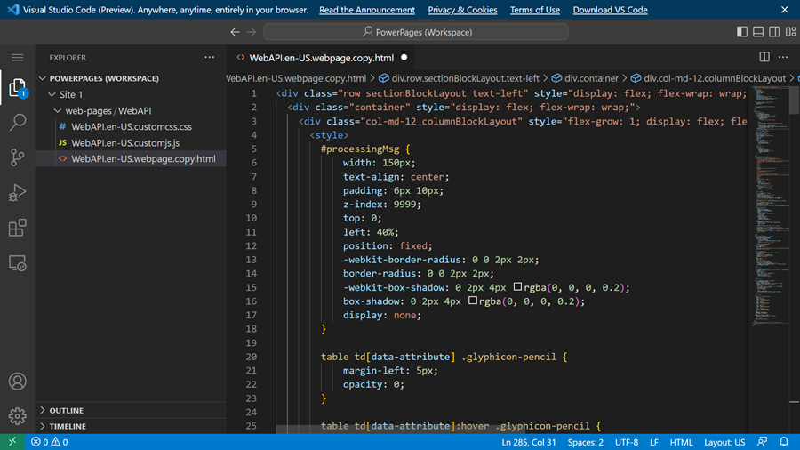

9.  Click **CTRL-S** to save the code. Close the **Visual Studio Code**
    tab.

10. After closing the **Visual Studio Code** tab, you will be on Power
    Pages portal.

11. Select **Sync** when prompted to synchronize the changes.

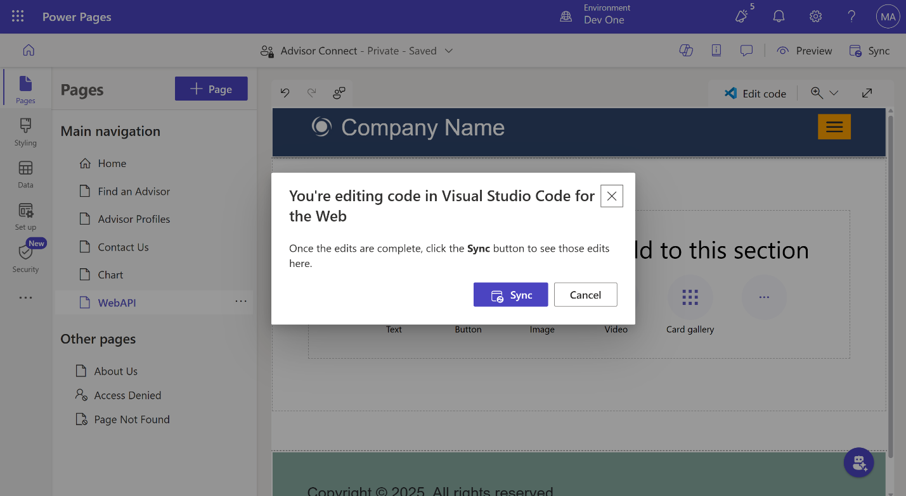

12. Select **Preview**.

13. Select **Desktop**.

14. On the WebAPI webpage, you can see the Contact created earlier.
    Select **+Add sample Record**.

15. New sample contact is now added to the list.

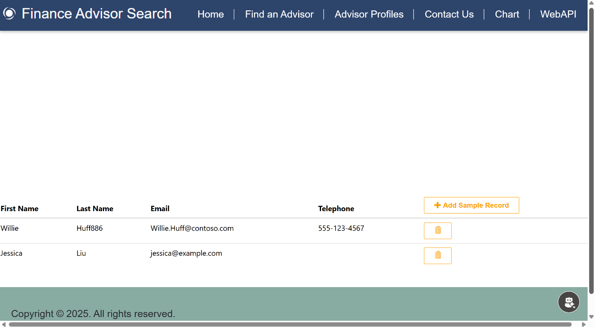
