# **Lab 0: Set up lab environment** #

**Estimated duration**: 10 min

## **Objective:** ##
In this lab, you will acquire Power Apps trial license.You will also add users and assign licenses to them at the same time.

### **Task 1: Assign** **Power Apps trial license** 

1.  Open a web browser on your VM and go to
    +++https://powerapps.microsoft.com/en-us/free/+++.

    

2.  Select **Start free**.

    

3.  Enter your **Office 365 admin credential**, check the checkbox to
    **accept the agreement** and click on **Start free**.

     

4.  Enter **password of your Office 365 tenant id** and then select
    **Sign in**.

    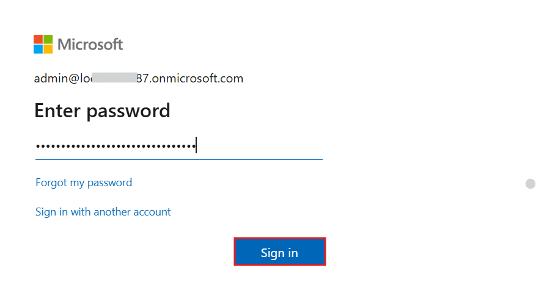

5.  Select **Yes** on **Stay signed in?** pop-up window.

    

6.  You can now see **Home page of Power Apps.** From the environment
    selector, select the developer environment – **Dev One** which is
    created for you.

     

7.  Open the new tab and go to Power Platform admin center by navigating
    to +++https://admin.powerplatform.microsoft.com+++ and if
    required, sign in using your given Office 365 admin tenant
    credentials.

    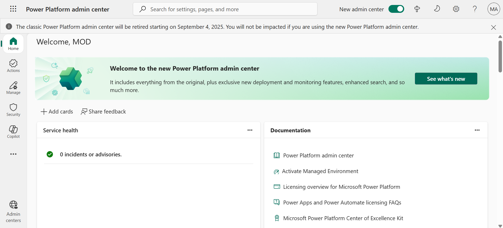

8.  From the left navigation pane, select **Manage** > **Environments**
    and then you can see, **Dev One** is your Dataverse environment.

     

9.  Review that the Dataverse environment has been changed to **Dev One
    Environment**.

    

### **Task 2: Create a Microsoft 365 User** 

1.  Navigate to the Microsoft 365 admin center using +++https://admin.microsoft.com+++.
    
2.	From the left navigation, select **Users** > **Active users** page, select **Add a user**.

    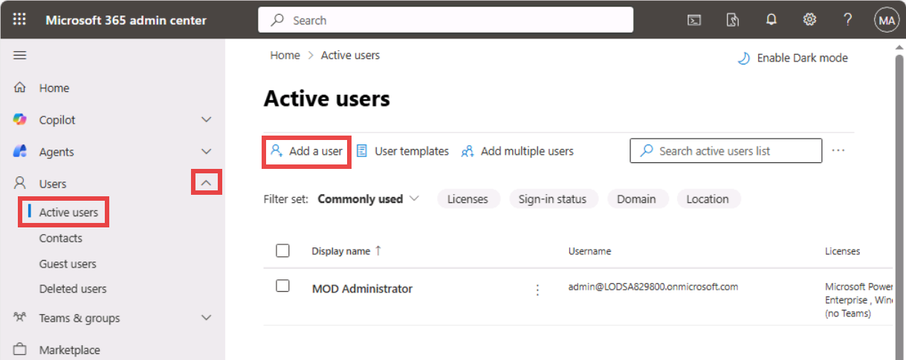
    
3.	Enter the following information and then click on the **Next** button.
   
    **First name**: +++Brooke+++
  	
    **Last name**: +++Gray+++
  	
    **Display name**: +++Brooke Gray+++
  	
    **Username**: +++brookeg+++

    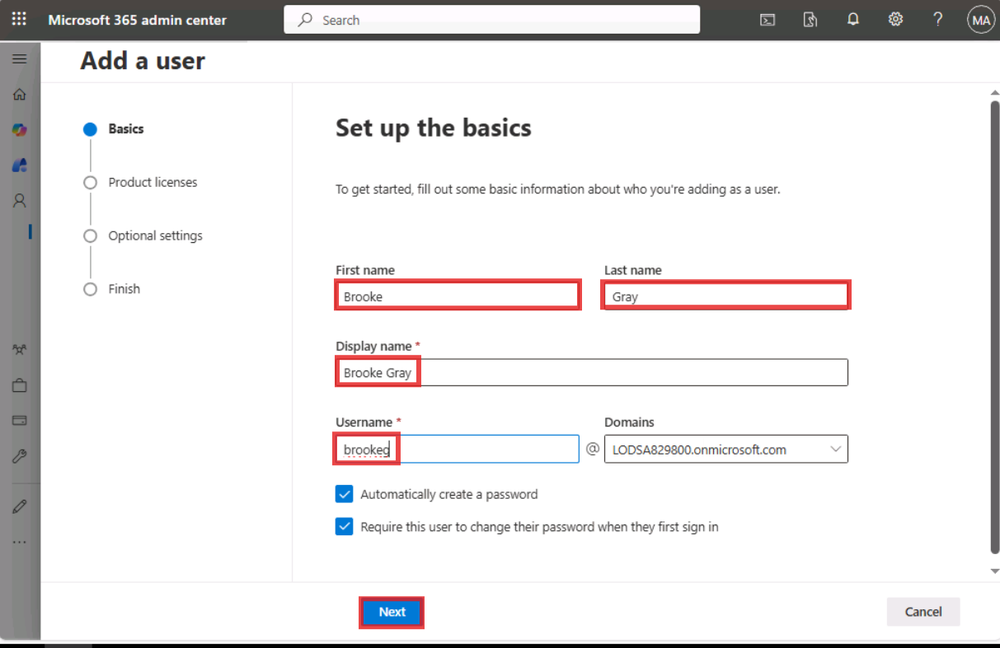

4.	On the **Assign product licenses** pane, select all the license check boxes and click **Next**.

     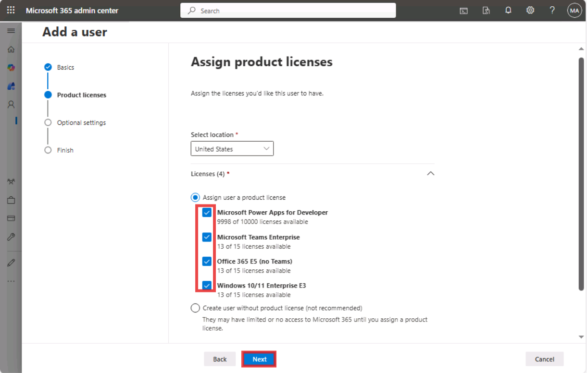

5.	Select **Next** on the **Optional settings** pane.

     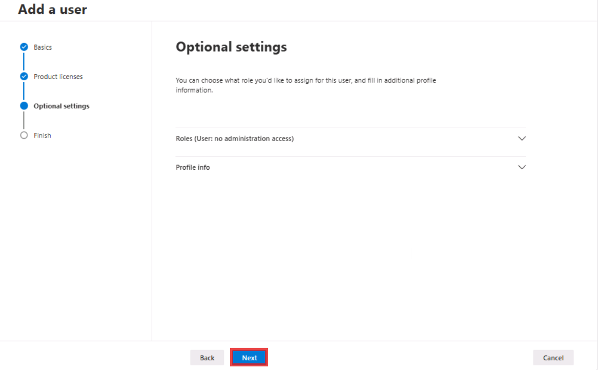

6.	On the **Review and finish** pane, click on the **Finish adding** buttion.

     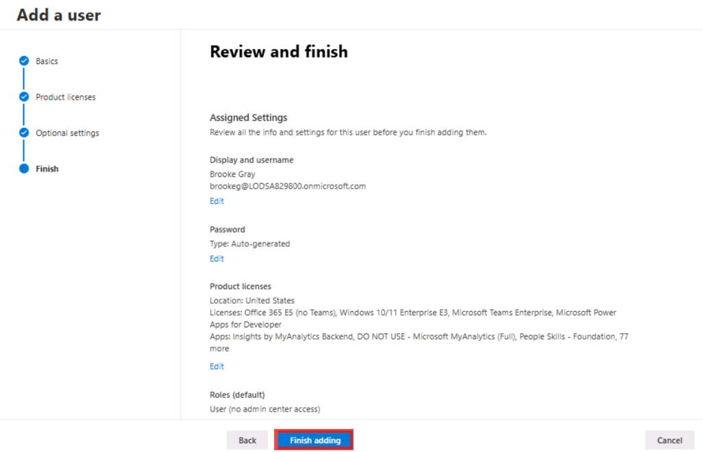

7.	Once done, click on the **Close** button.

     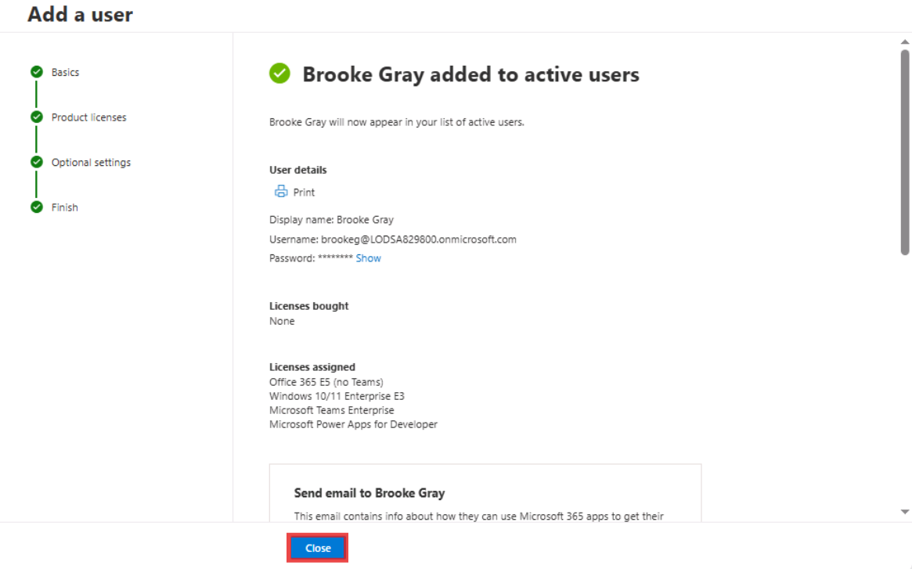

8.	Refresh the window to see the newly added user. On the Active users page, select all the new user then click on the          **More actions (…)** > **Reset password**.

     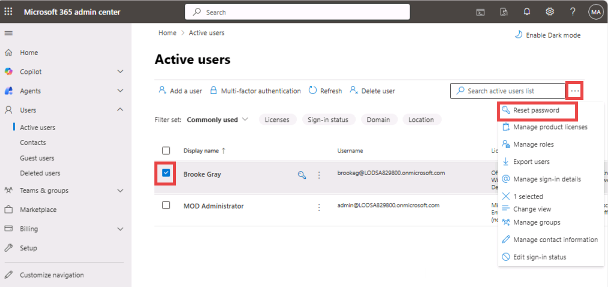

9.	To reset the password for the user, **uncheck all check boxes** and enter password as : +++Pa$$w01rd@124+++ and then         click on the **Reset password** button.

     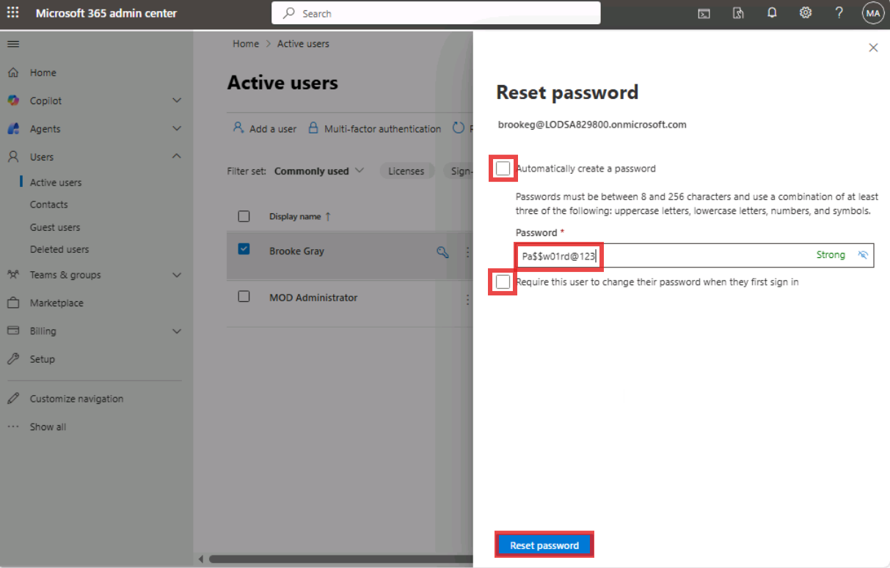

10.	On the **Password has been reset** pane, click on the **Close** button.
   
     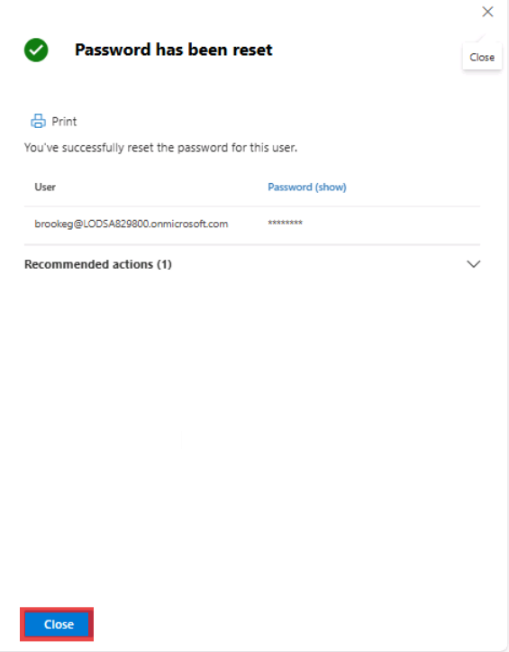
   	
**Summary**: In this lab, you acquired Power Apps trial license and also added a user from the Microsoft 365 admin center.

