---
lab:
  title: Lab 5 - In this lab, you will create an AI agent from an existing
Power Apps application
  duration: 15 minutes
  level: 100
  islab: true
---

## **Lab 5 - Build an AI agent to automate your business process**

**Objective**: In this lab, you will create an AI agent from an existing
Power Apps application to review app data by using natural language
queries over app data. You will configure and test the agent in Copilot
Studio to retrieve insights and summaries from your app’s underlying
data.

## **Exercise 1 - Build an AI agent** 

### **Task 1: Create an agent**

1.  Sign in to Power Apps at +++https://make.powerapps.com/+++ with the
    given Office 365 tenant credentials.

2.  Select **Agents** from the left navigation pane. If you don't
    see **Agents**, select **More**.

     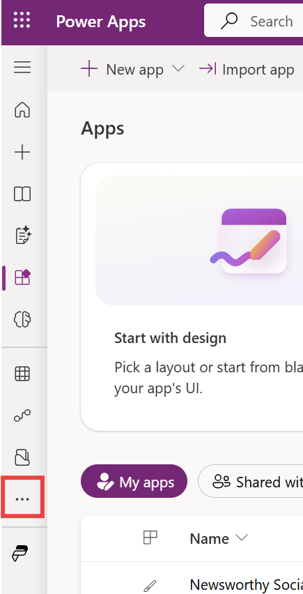

3.  Scroll down and then find and select **Agents**.

     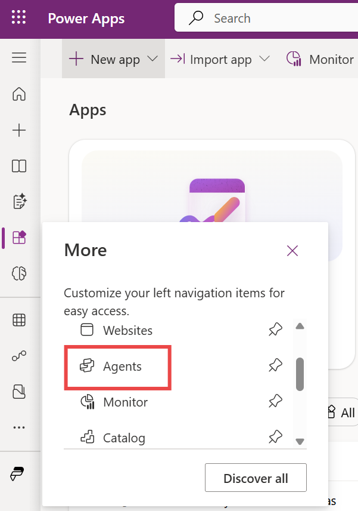

4.  Select **Create an agent from an app**. 

     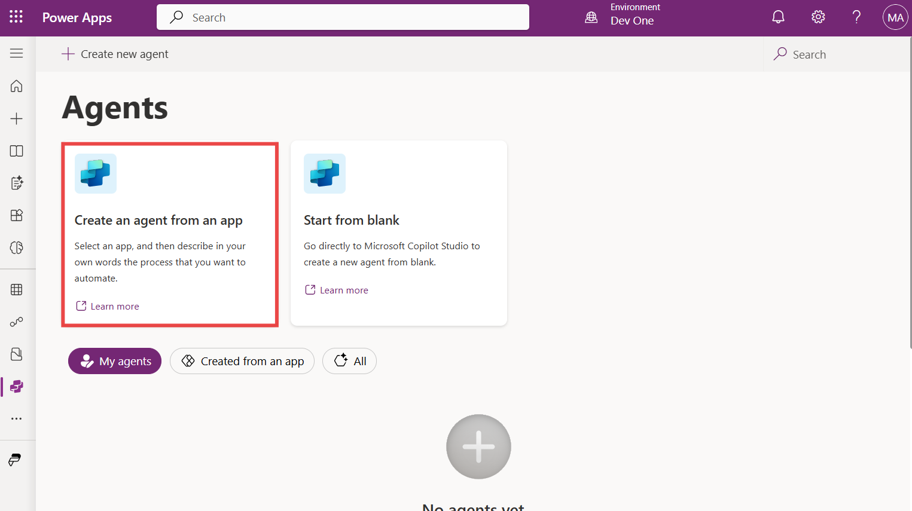

5.  Select your app and then select **Next** on the command bar. 

     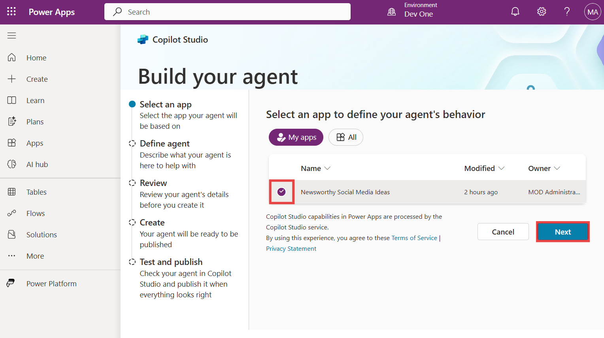

     **Note**: Alternatively, you can select **Apps** in the left navigation pane. Select your app, and then select **Create agent from app** on the command bar. You can also select **Commands** () for the app and then select **Create   agent from app**.

6.  Enter the given text in the Agent description text box to describe
    the process you want to automate, and then select **Next**.

     +++Natural language query over app data+++
    
     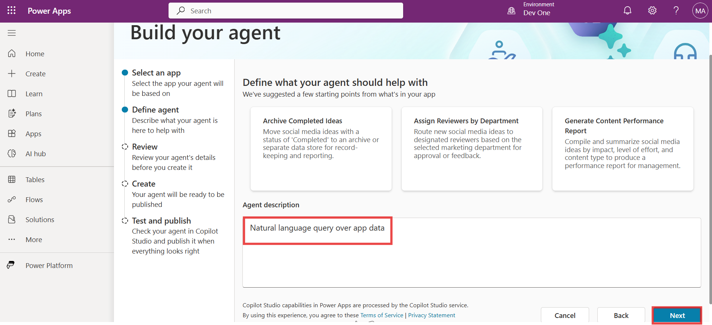

7.  Enter +++AskData+++ as the **Name** of the agent. Enter the given text
    in the **Description** text box.

     +++This agent will help you to understand your app's data. It returns results or summaries.+++
    
     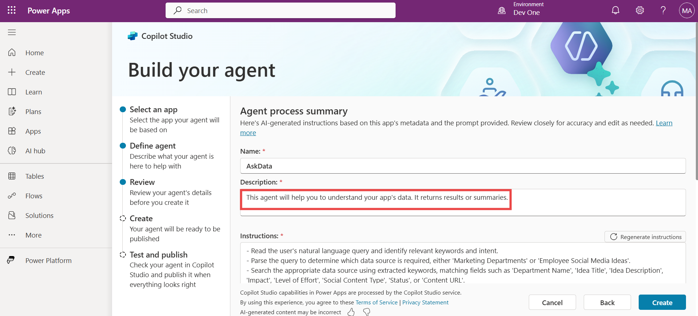

8.  Observe the instructions and knowledge sources used by the agent.

     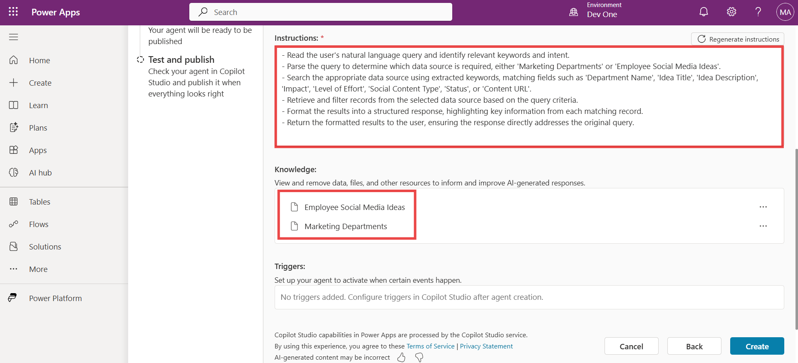

9.  When you're done, select **Create**.

     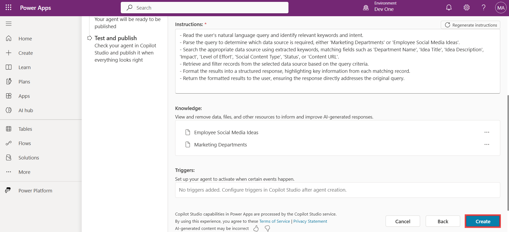

10. In a few seconds, you will see the notification that the agent has
    generated.

     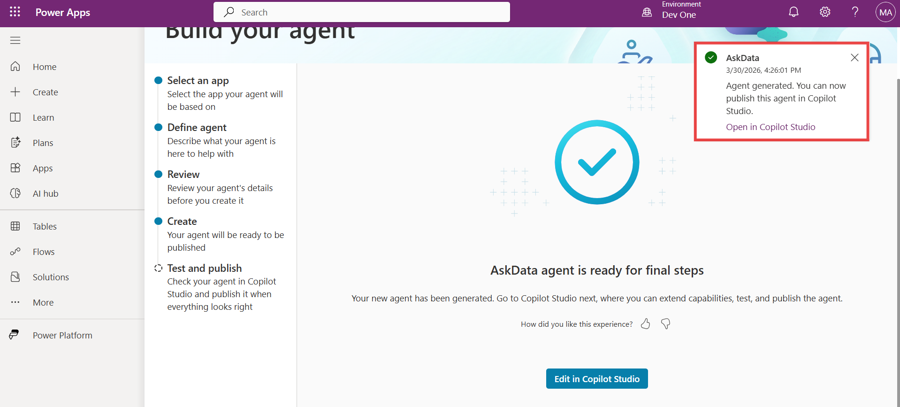

11. Select **Edit in Copilot Studio**.

     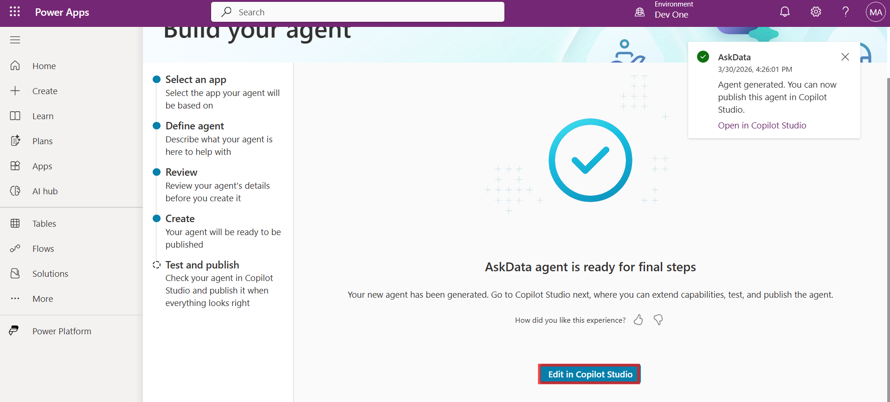

12. After a few seconds, the **“Welcome to Microsoft Copilot Studio”**
    pop-up window appears. Keep the **Country/Region** set to **United
    States**, and then select **Get started**.

     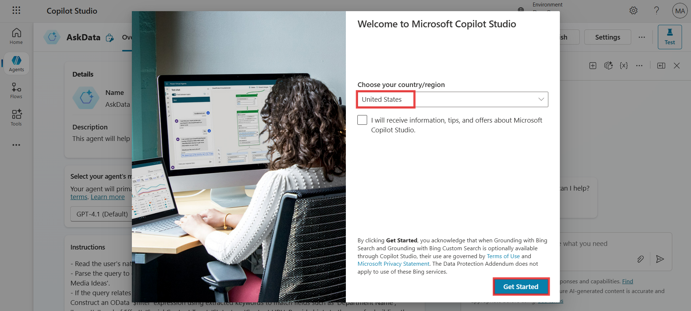

13. Select **Skip**.

     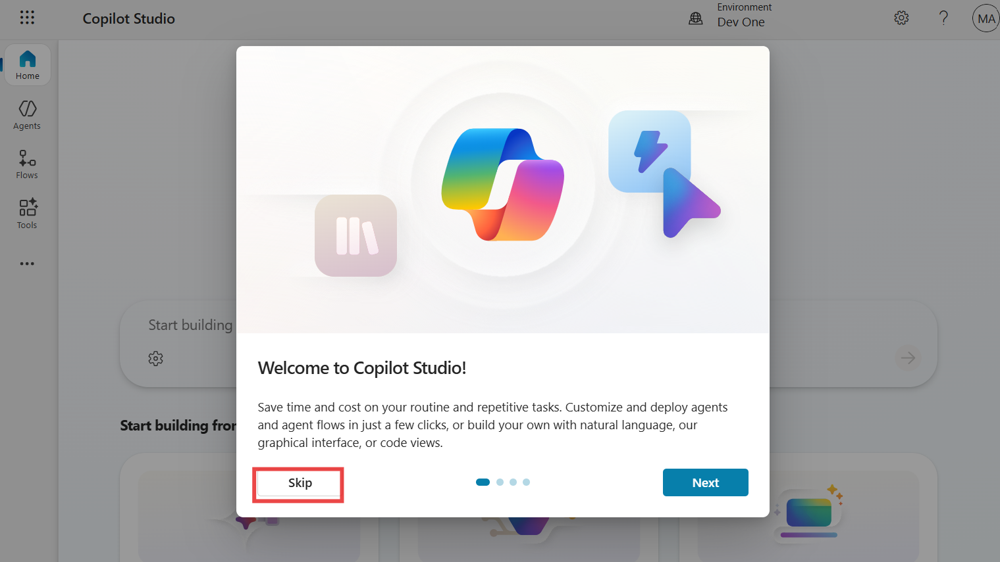

14. From the left navigation pane, select **Agents**. Open the
    **AskData** agent to test it.

     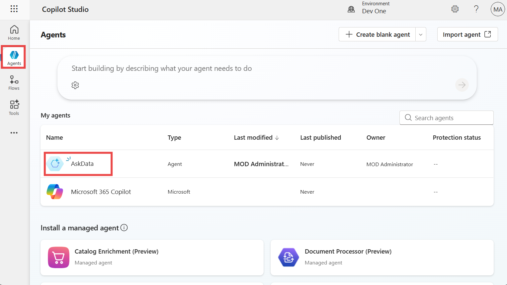

15. In the **Test your agent** pane, enter the given prompt and then
    select the send icon.

     +++Do you have any video-type content ideas+++
    
     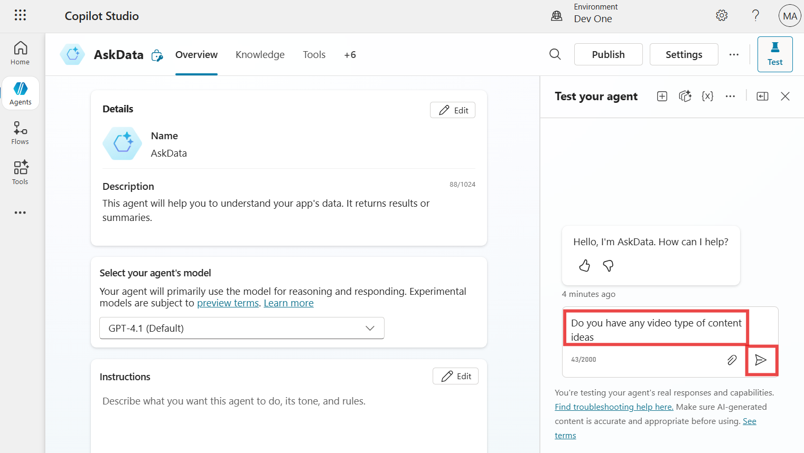

16. You can see the response given by the agent.

     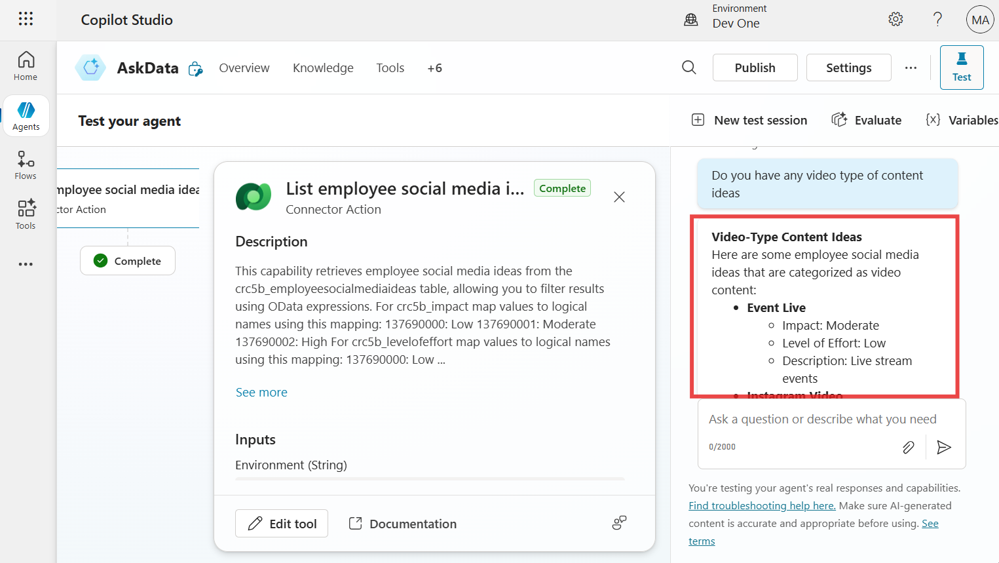

17. Enter one more prompt, as given below, to test the agent.

     +++Which ideas have a pending status?+++

     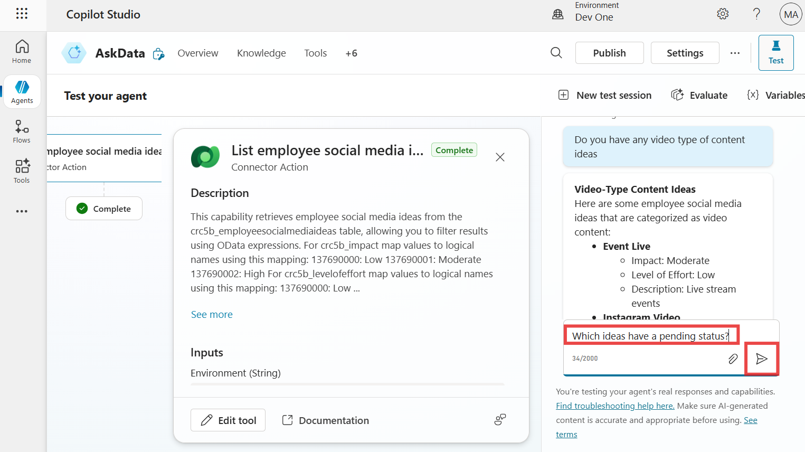

18. You can see the response given by the agent.

     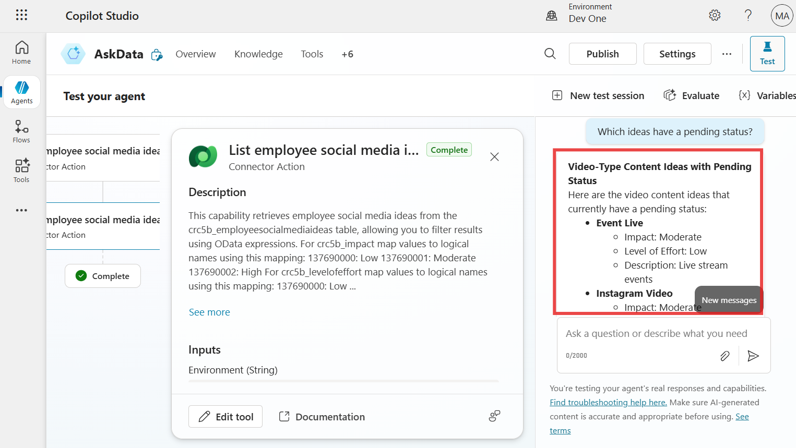
    
      **Summary:** In this lab, you learnt how to generate an AI agent
      directly from a Power Apps app to automate data exploration through
      natural language. You create an agent that understands the app’s data
      schema, test it by asking questions about records and statuses, and
      refine its behavior in Copilot Studio. This hands-on exercise
      highlights how agents can simplify data analysis and improve user
      interaction with business applications.
