---
lab:
  title: Lab 9 - Create your first code app (preview)
  description: +++pac code init --displayname MyFirstCodeApp+++
  duration: 58 minutes
  level: 100
  islab: true
---

# **Lab 9 - Create your first code app (preview)**

## **Exercise 1: Enable code apps on a Power Platform environment**

1.  Navigate to the Microsoft Power Platform Admin Center using
    +++https://admin.powerplatform.microsoft.com/home+++

2.  Close the welcome window if it appears.

3.  From the left navigation pane,
    select **Manage** > **Environments** and then select the **Dev
    One** environment you're using for the lab.

     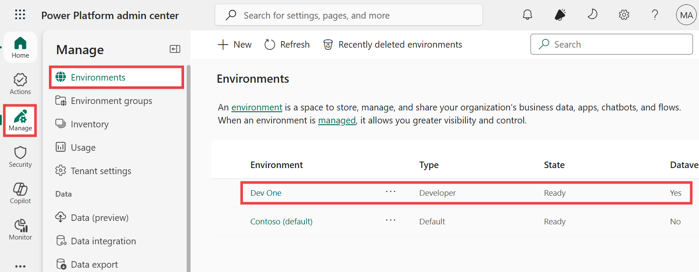

4.  Select **Settings**.

     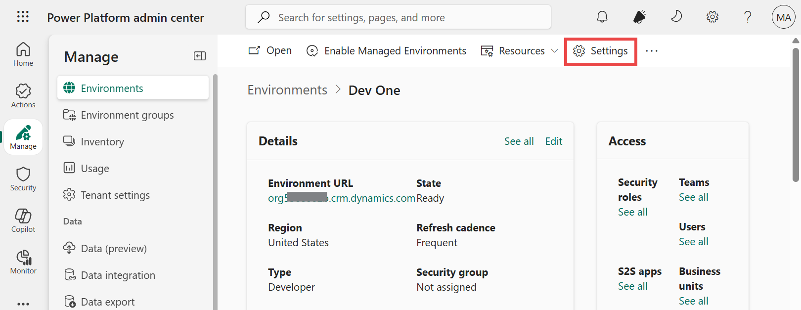

5.  Expand **Product** area and select **Features**.

     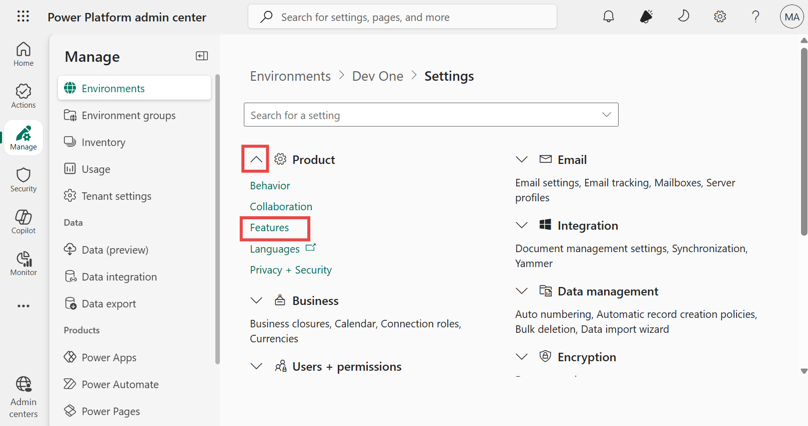

6.  Go to the feature **Power Apps code apps** and use the **Enable code
    apps** toggle to turn it on.

     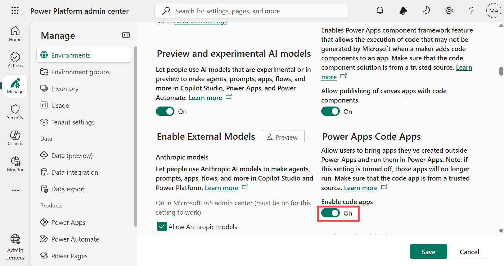

7.  Select **Save** in the settings experience.

     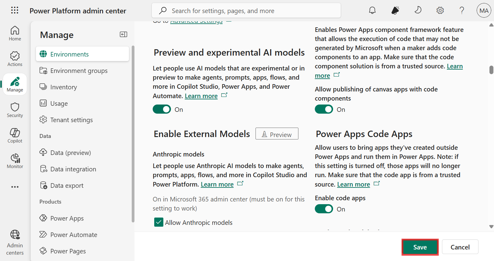

8.  Navigate to Power Apps maker portal using +++https://make.powerapps.com/+++ and
    make sure you are in the correct environment, i.e., **Dev One**.

     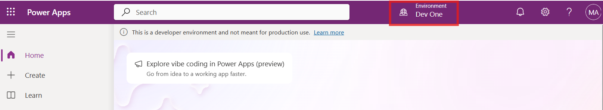

## **Exercise 2: Create a code app from scratch**

1.  Select the **More option (…),** **Terminal** and then select **New
    Terminal**.

     **Note:** If you don’t see (… 3 dots), select **hamburger | Terminal | New Terminal.**
    
     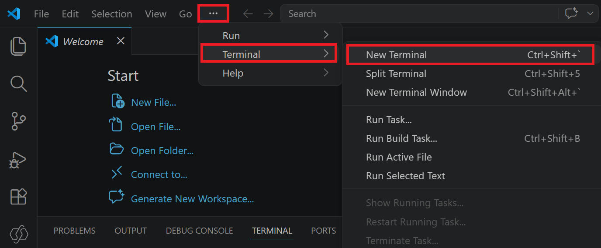
    
     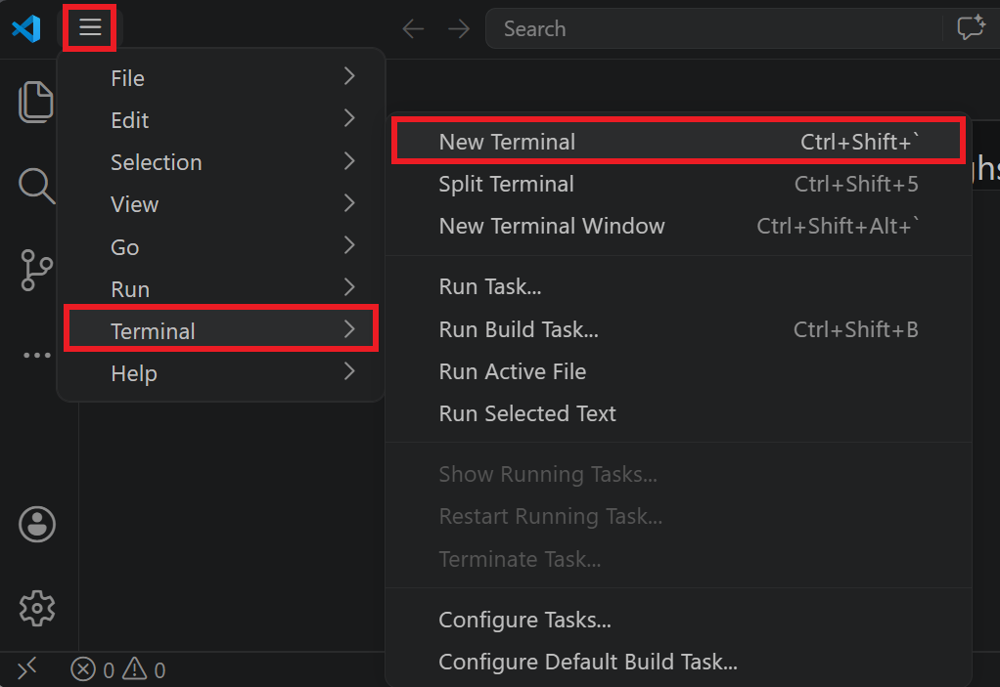

2.  Clone the repository using the given command.

    +++git clone https://github.com/microsoft/PowerAppsCodeApps.git+++

    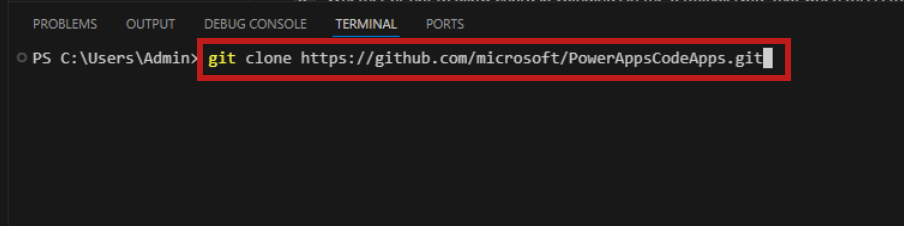

3.  Navigate to the **..\PowerAppsCodeApps\samples\FluentSample** using the given command.

     +++**cd C:\Users\Admin\PowerAppsCodeApps\samples\FluentSample**+++
    
     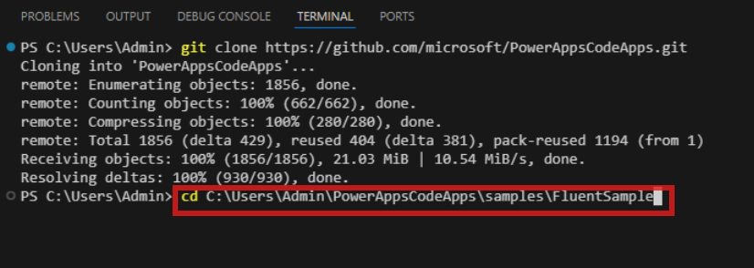

4.  Install the Power Apps client library for code apps using the given
    command.

     +++**npm install**+++
    
     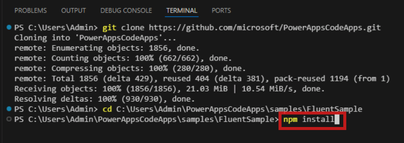
    
     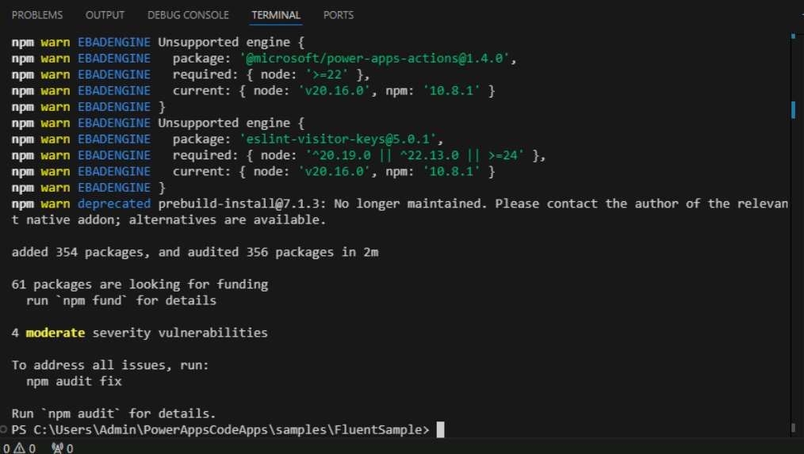

5.  Trigger the **npm run build** command to make sure the project is
    built without errors.

    +++**npm run build**+++
    
     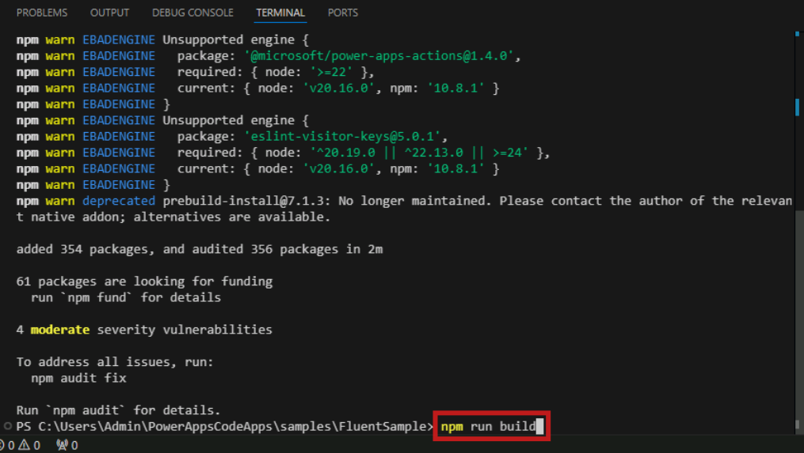
    
     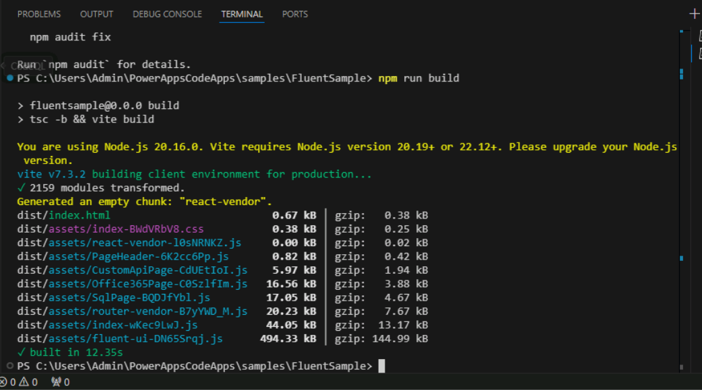

6.  Initialize your code app by using -

    +++**pac code init --displayname MyFirstCodeApp**+++
    
     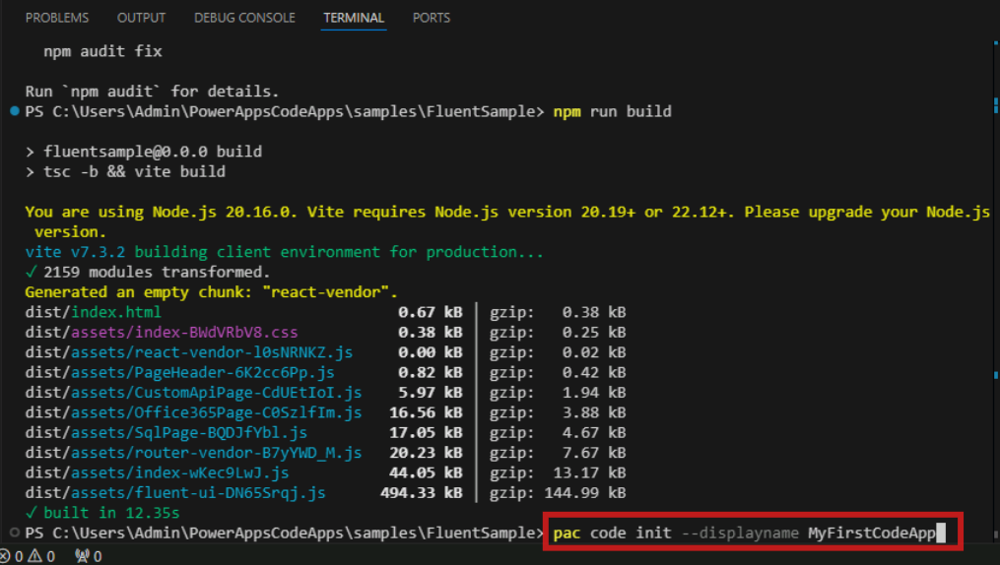
    
     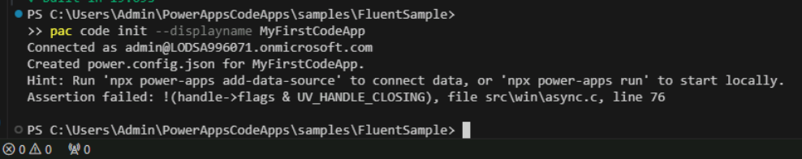

7.  Enter the following command to test your code app locally:

    +++**npm run dev**+++
    
    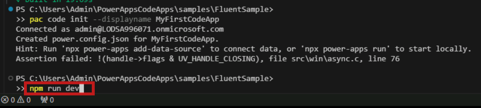

8.  Select **Allow access** if the Windows Security Alert pop-up
    appears.

    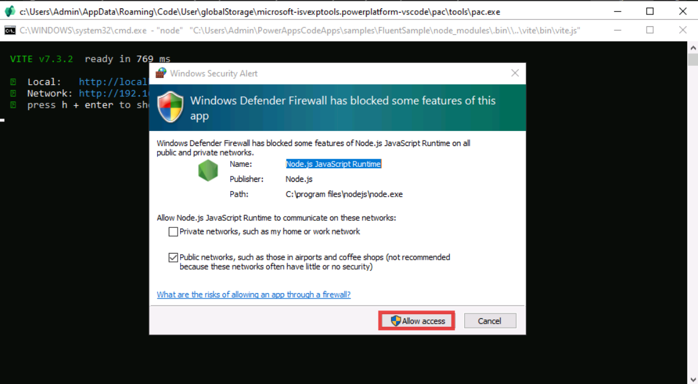

9.  Open the given URL: +++http://localhost:3000/+++

     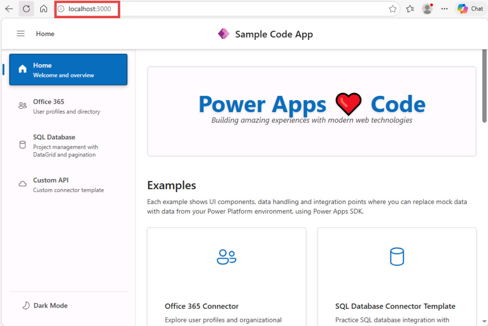

10. To deploy the app to the Power Apps environment, enter the following
    command.

     +++**Pac code push**+++

    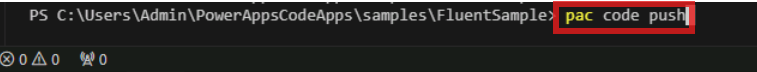

11. The Code App will be published, and you’ll also receive the
    published app URL as shown below:

    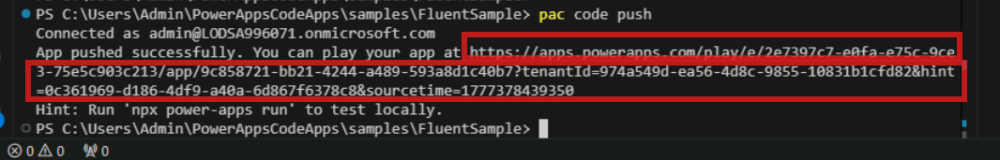

12. You can either use the URL to play the App or navigate to the Power
    Apps portal. Make sure you are in the **Dev One** environment and
    then select **Apps** from the left navigation pane. in the Power
    Platform.

    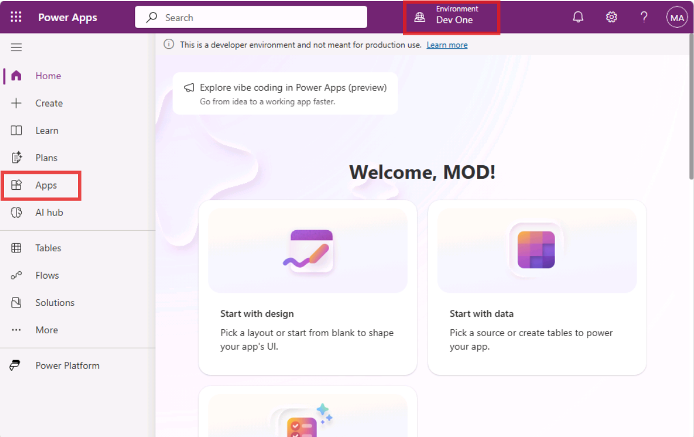

13. You can see the **MyFirstCodeApp** app listed under the **My apps**
    tab.

    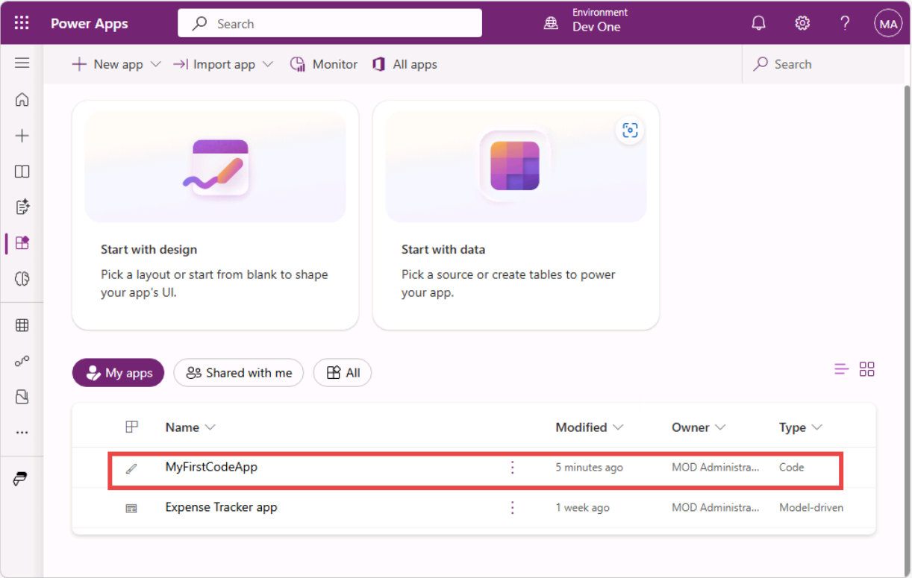

14. You can now play or share the app.
