# **Lab 9: Create an extendable web template**

**Estimated Duration:** 25 min

## **Objective:** 
In this lab, you will learn how to extend Liquid
templates by using extend and block tags, how to reuse Liquid templates
by using the include tag and how to apply table permissions to the
results of the new template.

**Note:** Copilot in Power Apps can generate different app layouts,
forms, and data connections apps.

### **Task 1: Create a partial template**

Your first task is to create a partial template that won't be used to
render a page but will instead be inserted into another template.

1.  Sign in to Power Pages
    +++https://make.powerpages.microsoft.com/+++.
    If your site is already open, you can skip Steps 1 through 3.

2.  Select the target environment **Dev One** in the upper-right corner.

    

3.  Under **Active sites** tab, you can see your site – **Finance
    Advisor Search**. Select **Edit**.

    

4.  Expand the extension menu (ellipsis), and then select **Portal
    management** to open the Portal Management app.

    

5.  Select **Web Templates**.

    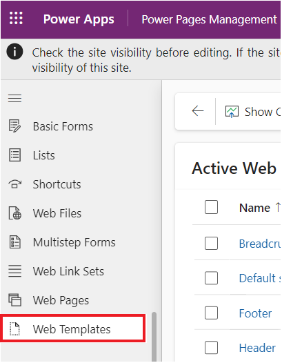

6.  Select +**New**.

    

7.  Enter the following values:

    **Note**: Delete any extra characters that may appear after pasting the code.

    - **Name** - +++Directory+++ 

    - **Website** - Select your current website - Finance Advisor Search

    - **Source** - Enter the following content:

     ``` 

        
        
        <fetch>
        
        <entity name="account">
        
        <attribute name="name" />
        
        </entity>
        
        </fetch>
        
        
        
        
        
        <ul>
        
        
        
        <li>{{ account.name }}</li>
        
        
        
        </ul>
        
        
        
        <div class="alert alert-warning">You do not have permissions to
        access the directory.</div>
        
        

    ``` 

    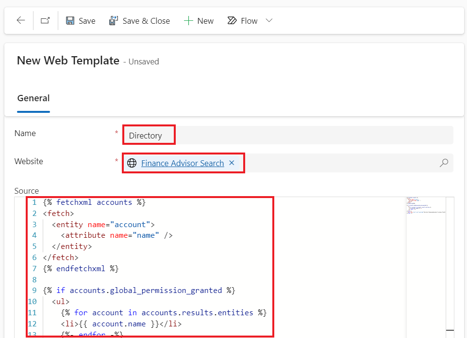

7.  Select **Save & Close**.

    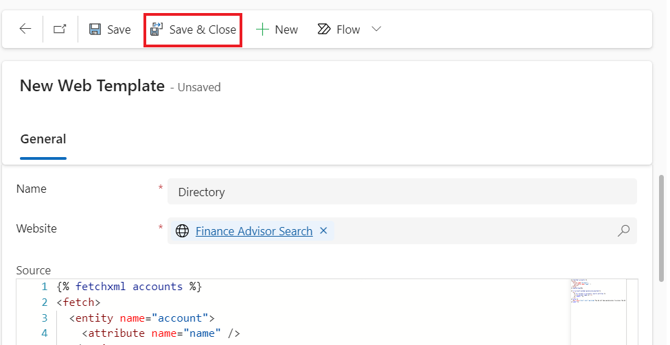

### **Task 2: Extend an existing template**

    Next, you'll create a new template that extends an existing Liquid
    template and then insert the template that you previously created.

1.  On the **Web Templates** page, select **+New**.

    

2.  Enter the following values:

    **Note**: Delete any extra characters that may appear after pasting
    the code.

    - **Name** - +++Directory Template+++

    - **Website** - Select your current website - Finance Advisor Search

    - **Source** - Enter the following content:

   ``` 

        
        
        
        
            <h2>Directory</h2>
        
            
        
        

    ``` 

    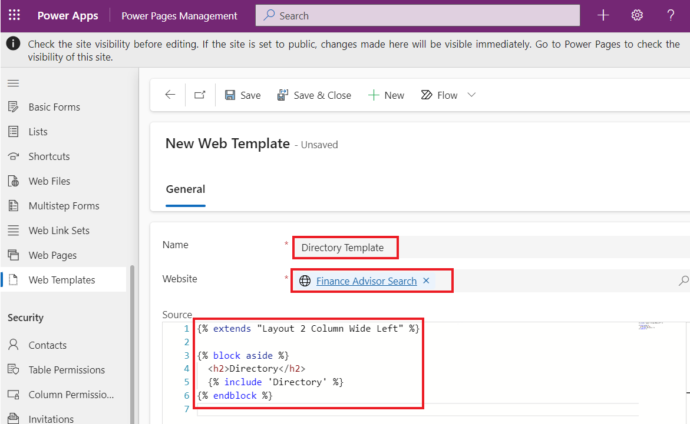

2.  Select **Save & Close**.

    

### **Task 3: Create a page template and associate with that page**

In this task, you'll create a page template that uses your new web
template and will include the Directory output.

1.  From the left navigation pane, select **Page Templates**.
    Select +**New**.

    

2.  Enter the following values:

    - **Name** - +++Directory Page Template+++

    - **Website** - Select the current website - Finance Advisor Search

    - **Type** - Select **Web Template**

    - **Web Template** - Select **Directory Template**

    - **Table Name** - Select **Web Page**

3.  Select **Save & Close**.

    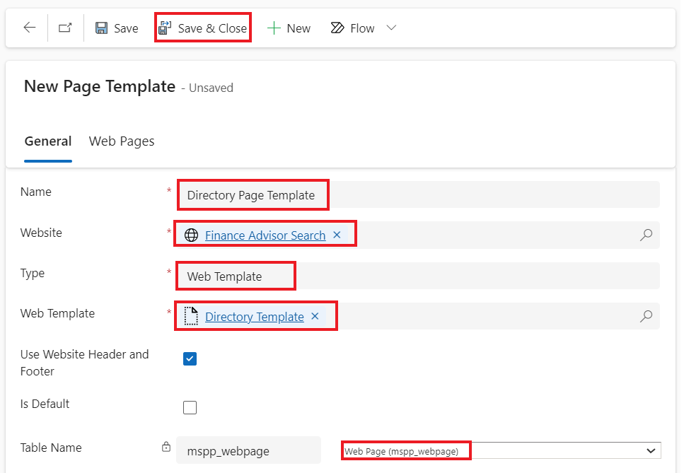

### **Task 4: Test the page template**

Your next step is to test that your new template works:

1.  Return to the Power Pages design studio Home tab.

2.  Select **Sync** to synchronize the changes.

    

3.  Select the **Pages** workspace. Select **+ Page**.

    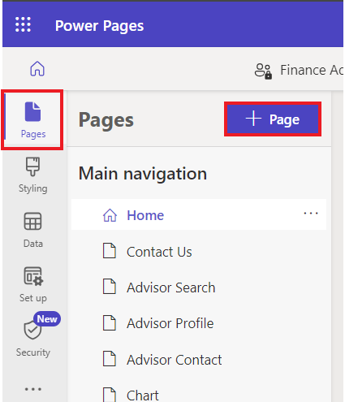

4.  When prompted with the **Describe a page to design it** window,
    click on **Other ways to add a page**.

    

6.  In the **Add a page** dialog, complete the following steps:

    a. Enter +++Directory+++ as the page name.

    b. Select **Custom layouts** and then select **Directory Page Template**.
    
    c. Select **Add**.

    
    
    The empty page will display with the message "You don't have
    permissions to access the directory" in the right panel.
    
    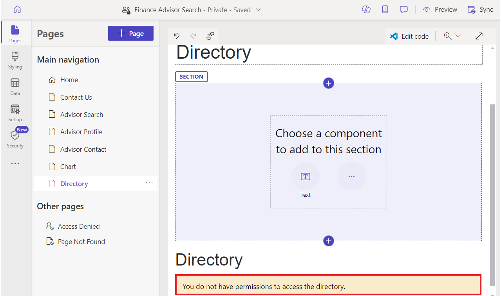

### **Task 5: Add table permissions**

**Warning:** Granting global read permission to anonymous users is for
illustrative purposes only. Exercise caution to avoid unintentionally
exposing sensitive information by granting excessive permissions and not
including appropriate filters in your views or FetchXML expressions.

Follow these steps to add table permissions.

1.  If you've already completed Lab 7, you may skip Task 5 entirely. If
    not, Select **Security workspace** and then select **Table
    Permissions**.

    

2.  Select **+ New permission**.

    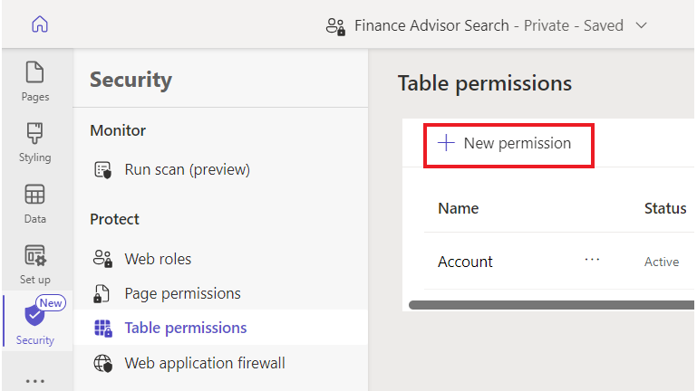

3.  Enter the following values:

    - **Name** - +++Account Directory+++

    - **Table** - Select the **Account** table  

    - **Access type** - Select **Global access**
      
    - **Permission to** - Select **Read**

   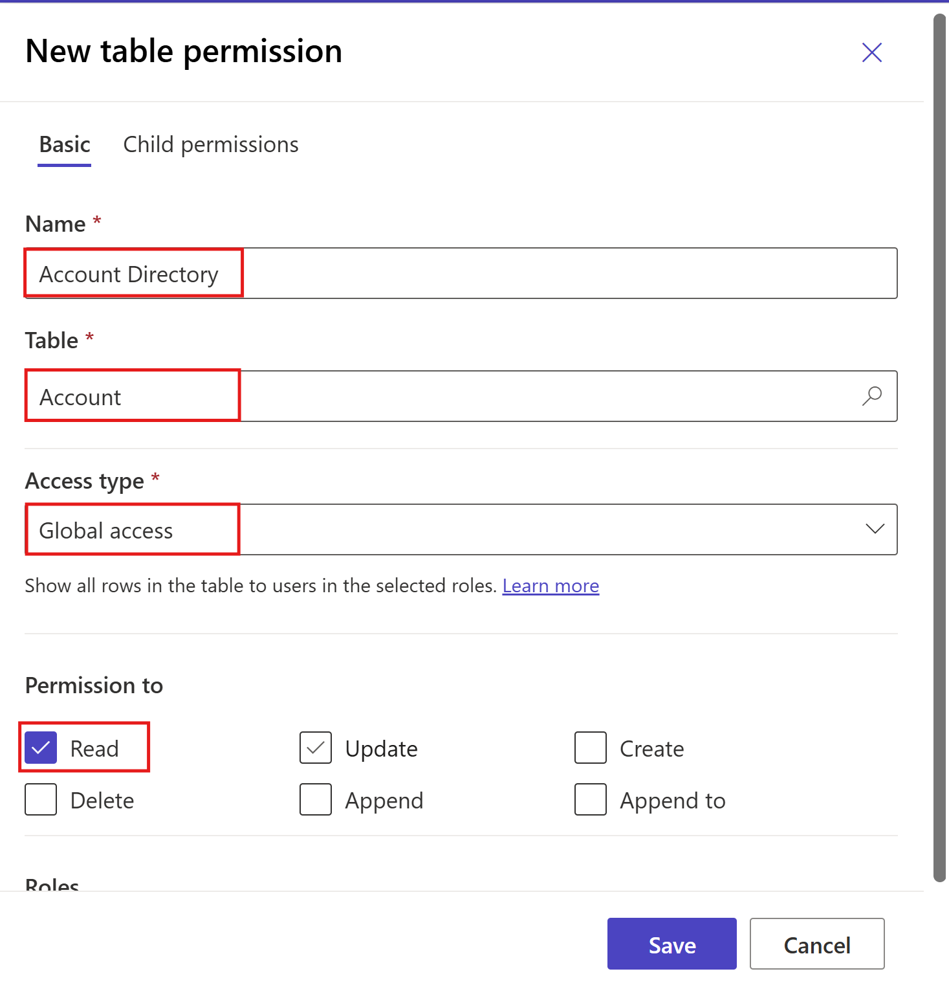

4.  Select **Add roles**.

5.  Select **Anonymous users** and **Authenticated users**.

    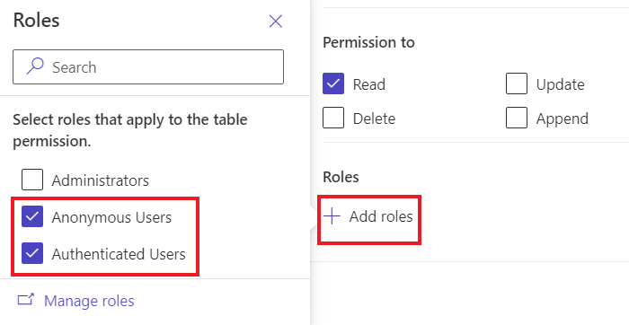

6.  Select **Save**.

    

7.  Select **Save**.

    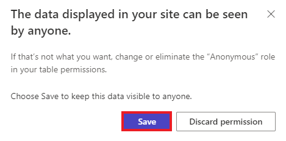

### **Task 6: Test the template**

    Your final task is to test your new template:

1.  Select the **Pages** workspace and then select
    the **Directory** page.

      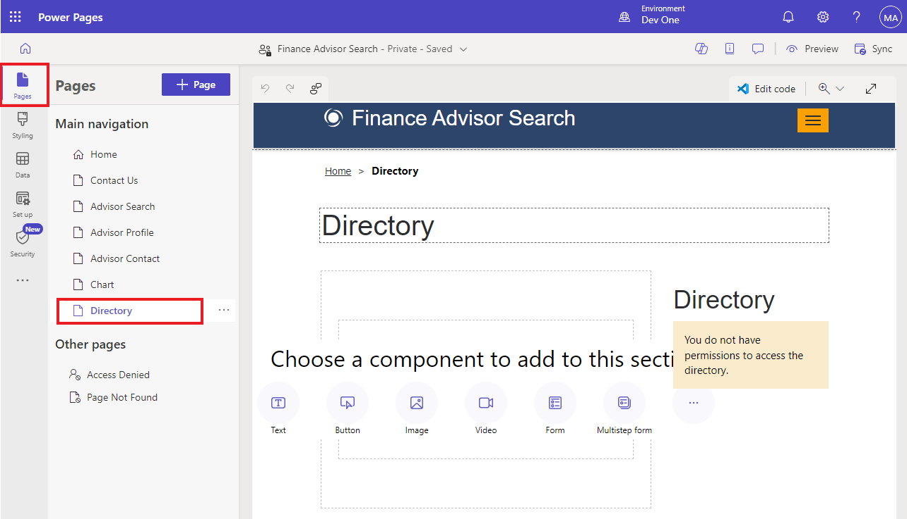

2.  Select **Preview | Desktop**.

    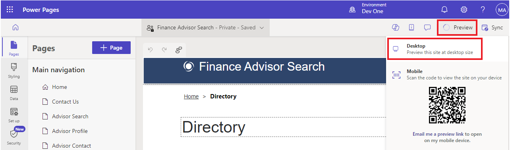
    
    **Note:** A simple browser page refresh won't be sufficient to update
    the data. Using Preview command instead rebuilds the site cache.
    
    The page should now be displayed and include the list of accounts in
    the right panel.
    
    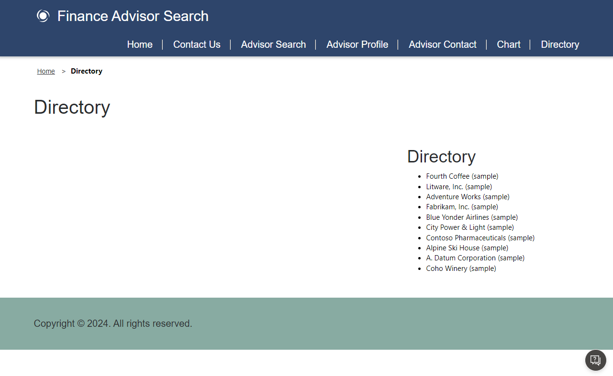

**Summary:** In this lab, you have learnt building and extending Liquid
templates. You built a new page template that includes a side panel that
lists all accounts in Dataverse.


